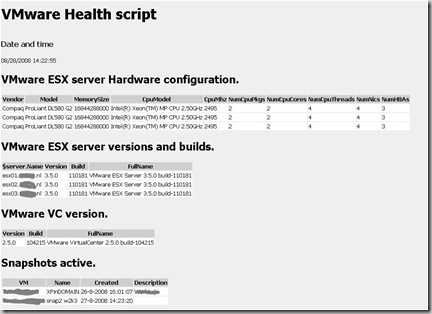

Healthcheck is a PowerShell script that reports information like **snapshots**, **VMware tools version**, **datastore space, CDROM and/or floppy drives connected** etc. to HTML and e-mail the output to a person or distribution list.

**Reason for creating this script:**

As VMware Consultant I see a lot of common problems in VMware environments like:
- Snapshots are enabled and forgot
- Datastores are almost full (for example if snapshots are enabled)
- VMware tools versions are different
- CDROM and floppy drives are still mounted to the VM
- Virtual Machines have CPU and Memory limits or reservations (VMs are swapping)
- In the VM, the VMware Tools timesync option is not enabled

In the Virtual Infrastructure Client (VIC) it is difficult to see this sort of information. By creating a PowerShell script,  I can do a quick inventory.  In a lot of VMware environments I created a scheduled tasks, so the script runs once a week and sent to HTML rapport to the administrator.

**What does the script:**

I wrote a PowerShell script with HELP from the VMTN community that makes a HTML file and sent the output by e-mail to a person or distribution list. The Healthcheck script does the following checks:
- VMware ESX hardware
- VMware ESX versions
- VMware VirtualCenter versions
- Active snapshots
- CDROM and Floppy drive(s) mounted to the VM
- Datastore information like capacity, free space and the percentage free space
- VirtualMachine (VM) information like VMware tools version, CPU, Memory reservations and limits etc.
- On what VMs VMware Tools timesync is not enabled

**Requirements:**

The following software must be installed:
- Microsoft PowerShell 5.1
- VMware Infrastucture (VI) toolkit for Windows 1.0 [http://www.VMware.com/download/sdk/](http://www.VMware.com/download/sdk/)
- Set the ExecutionPolicy in Windows PowerShell to RemoteSigned by using the following command:
**set-ExecutionPolicy RemoteSigned**

**Installation:**
- Unzip the Healthcheck.zip script to a directory on the VC server for example.
- When the ZIP if unpacked there are two files:
- Healthcheck.ps1, this is the PowerShell script
- Style.CSS, controls the HTML layout

**Configuration:**

- Edit the PowerShell.ps1 file, edit the following variables:
```PowerShell
$vcserver="localhost"
Enter the VC server, if you execute the script on the VC server you can use the localhost name
$filelocation="D:\\temp\\Healthcheck.htm" Specify the location where to store the HTML output
$enablemail="yes" Enable (yes) or disable (no) to sent the script by e-mail
$smtpServer = "mail.ivobeerens.nl" Specify the SMTP server in your network
$mailfrom = "VMware Healtcheck <[PowerShell@ivobeerens.nl](mailto:PowerShell@ivobeerens.nl)\>" Specify the from field
$mailto = [ivo@ivobeerens.nl](mailto:ivo@ivobeerens.nl)
Specify the address where the e-mail to sent  to
```

**Usage:**

Manually run the Healthcheck.ps1 script":

1. Open PowerShell

2. Browse to the directory where the Healthcheck.ps1 script resides

3. enter the command:
```PowerShell
./Healthcheck.ps1
```
To create a schedule task in for example Windows 2003 use the following syntax in the run property: PowerShell -command "& 'path\Healthcheck.ps1' edit the path
```PowerShell
PowerShell -command "& 'path\Healthcheck.ps1'
```
edit the path .

**Future:**

- List Orphaned VMDK's
- Add performance information like VM usage
- Check timesync on the VMware hosts

Happy testing :-)

Download Link: Healthcheck script

The script is posted on the VMware PowerShell contest forum, [link](http://communities.VMware.com/message/1036432)

Some screenshots of the HTML output:

[](images/1jpg.jpg)

 [](images/2.jpg)

[](images/3.jpg)


