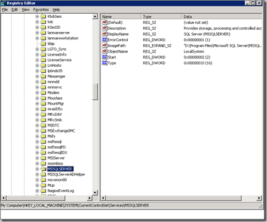
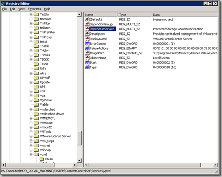
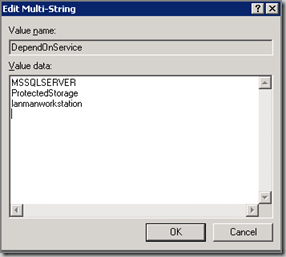

After rebooting the VMware VirtualCenter (VC) server, i was unable to logon using the VI-client in VC. In the Windows event log the following  Error is listed:

> Event Type: Error Event Source: Service Control Manager Event Category: None Event ID: 7031 pubDate:  25-9-2008 Time:  13:39:58 User:  N/A Computer: VC1 Description: The VMware VirtualCenter Server service terminated unexpectedly.  It has done this 1 time(s).  The following corrective action will be taken in 300000 milliseconds: Restart the service.
> 
> For more information, see Help and Support Center at http://go.microsoft.com/fwlink/events.asp.

It seems that the VC server service is started before the SQL 2005 service is started. The solution is the delay the VirtualCenter service from starting till the Microsoft SQL 2005 service is started. Microsoft has a KB article "[How to delay loading of specific services".](http://support.microsoft.com/kb/193888)

I did the following:

Open the regedit.exe and browse to the HKLM\\SYSTEM\\CurrentControlSet\\Services\\**MSSQLSERVER** (for MS SQL 2005 standard). So you know the name of the service.

Browse to HKLM\\SYSTEM\\CurrentControlSet\\Services\\vpxd and open the DependOnService property

Add the name MSSQLSERVER to this multi-string. **Ensure that the last line is empty**.

Close the Registry Editor and restart the VirtualCenter server and test if it VMware VirtualCenter service starts.

