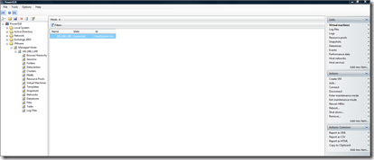
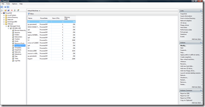

On the PowerGUI website is a new version off VMware PowerPack released.

A PowerPack extends the PowerGUI with a set of folders, nodes, links and actions that allow you to manage VMware Infrastructure. With the PowerPack no PowerShell knowledge is needed.

The new version(December 19, 2008 (2.0.0) has the following new enhancements and supported features:
- reorganized the PowerPack structure to facilitate easier management of multiple hosts and to allow users to retrieve objects from one or more of the hosts they are managing whether they are already connected or not  
- added support for browsing the VMware Inventory hierarchy (includes Hosts and Clusters, Virtual Machines and Templates, Networks and Datastores), including being able to browse directly into the file system on the datastores  
- added many new links and actions  
- exposed many more VMware Infrastructure objects through topological views and through integration in the hierarchy  
- improved the performance of many nodes, links and actions  
- added single sign-on support (note that connecting to multiple hosts using the same username but different passwords is currently not supported, but we are working on that and will provide support for this soon)  
- tested management against Virtual Center 2.0, ESX 3.0x and 3.5, ESXi 3.5 and Virtual Server 2.0 (note: management of Virtual Center 2.0 requires version 1.0 of the VMware VI Toolkit)  
- and more!

Supported features:  
• Management of multiple VMware Virtual Center, ESX, ESXi and VMware Server hosts when using the VMware VI Toolkit 1.0 release  
• Management of multiple VMware Virtual Center, ESX and ESXi hosts when using the VMware VI Toolkit 1.5 release  
• Single sign-on to multiple hosts using the same credentials  
• Ability to browse through inventory hierarchies on Virtual Center  
• Ability to view topological data for any managed server  
• Management of datacenters, clusters, resource pools, hosts, folders, virtual machines, templates, snapshots, networks, datastores, files, tasks and log files

Some screenshots:

