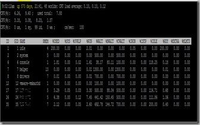

Today I did a Healthcheck of a VMware ESX environment.  The environment was still VMware ESX 3.0.0 build 42531. In ESXTOP the uptime was 570 days! WOW the last time I saw systems with such a long uptime was in the Netware days. Make sure to install the required security patches frequently!

