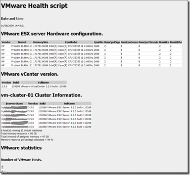

- VMware vCenter version
- Cluster information (Updated)
- VMware statistics (New)
- List the active Snapshots
- CDROMs connected to VMs
- Floppy drives connected to VMs
- Datastores Information such as free space  
- RDM information (New)
- VM information such as VMware tools version, processor and memory limits
- VMs and there datastore (New)
- VMware timesync enabled
- Percentage disk space used inside the VM (New)
– VC error logs last 5 days (New)

It is possible to schedule this script and output the content to HTML and e-mail it.

If you have suggestions , let me know!

[]

