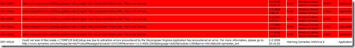

Here a new PowerShell report-event script.

[]

figure 1. Output reports-event script

You can specify multiple servers in a text file, select how many hours from the current time to look in the eventlog and e-mail the HTML file after generation. 

The following syntax can be used:
```
get-content c:\\script\\servers.txt | c:\\scripts\\report-event.ps1 – report c:\\script\\eventlog.html –hours 48 –smtp mail.beerenss.nl –sendto [eventlogs@beerens.nl](mailto:ivo@ivobeerens.nl) –from [eventlog@beerens.nl](mailto:eventlog@ivobeerens.nl)
```

Explanation:

get-content c:\\script\\servers.txt, text file containing the server names

– report c:\\script\\eventlog.html, name of the HTML file
> 
> | c:\\scripts\\report-event.ps1, call the actually script
> 
> –hours 48, hours to report from the curren time
> 
> –smtp mail.beerens.nl. SMTP server to sent the HTML rapport 
> 
> –sendto [ivo@beerens.nl](mailto:ivo@ivobeerens.nl), To address
> 
> –from [eventlog@beerens.nl](mailto:eventlog@ivobeerens.nl) . from address

Schedule this script to run frequently to watch your eventlogs!

Download the script [here.](http://jdhitsolutions.com/resources/scripts/Report-Events.txt)