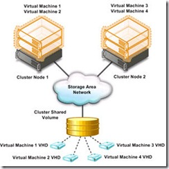
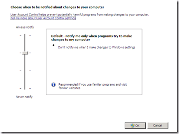
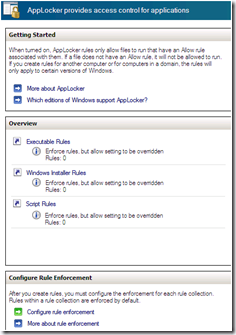

The last three days i attended Microsoft TechDays in Antwerpen (Belgium). The first day (pre-conference) was dedicated to Windows 2008 R2. The other 2 days I attended sessions such as Windows 7, Powershell V2, SYSVOL replication and Remote Desktop Services (former Terminal Services). Here is an short overview:

- Windows 2008 R2 will be released in **64-bit** version **only.**

**-** All new Windows server product can be managed through PowerShell  PowerShell 2 is default installed on Windows 2008 R2 and Windows 7. In PowerShell 2 you can remote manage your computers.

- **Active Directory Recycle Bin**, when you deleted an AD object, it is possible to easily restore this object through PowerShell. Default this feature is disabled! More information can be found [here](http://technet.microsoft.com/en-us/library/dd392261.aspx)

- Windows 2008 Core contains .NET and  PowerShell 2.0 support

- In Windows 2008 the SYSVOL replication goes through DFS-R, in earlier versions FRS is used. One great benefit is that DFS-R is faster because it only replicates the changed bits, FRS copies the whole file that is changed. If your DC is upgraded to Windows 2008 you can migrate from FRS to DFS-R. More information can be found [here](http://blogs.technet.com/filecab/archive/2008/02/08/sysvol-migration-series-part-1-introduction-to-the-sysvol-migration-process.aspx).

-  **Cluster Shared Volumes (CSV),**   this is a feature for Failover clustering. It allows multiple VMs to be running on a single LUN (volume). CSV uses the NTFS file system. With CSV it is possible to do Live Migration (Hyper-V) of VMs without downtime. Live Migration is the VMotion feature from Microsoft.

[]

- **BranchCache,** caches WAN bandwidth for HTTP and SMB traffic at the branche office network. This improves the response times and reduces WAN  traffic.

With the **distributed cache** option the cache is placed on other computers on the branche network. With the Hosted cache option the cache is placed on a Windows 2008 R2 server on the branche office.  BranchCache can only be used in Windows 7 and Windows 2008 R2.

More information can be found [here.](http://jdhitsolutions.com/resources/scripts/Report-Events.txt)

- **Direct Access**, get instant access to your corporate network without establish a VPN connection. Direct Access uses IPSEC and IPv6.  DirectAccess can only be used in Windows 7 and Windows 2008 R2. More information can be found Here.

- **Terminal Services** is renamed in **Remote Desktop Services (RDS)**. It will be used for SBC and VDI.

- The Remote Deskop Virtualization (RD Virtualization) is a special role that integrates with Hyper-V and used for Virtual Desktop Infrastructure (VDI) desktops.

- The connection broker is called Remote Desktop Connection Broker (RD Connection Broker).

- Windows Vista and Windows 7 can be used as desktop for VDI.

- The RDP protocol is improved with rich multimedia, 3D rendering, real multi-monitor support (no span) and two way audio redirection, VOIP applications such as Skype can be used.

More information can be found here.

**Windows 7**

- Homegroup, an easy way to share your Pictures, Videos, Documents, Music and printers

- Most software that worked on Vista will work on Windows7, except software with low level drivers such as Anti-virus and firewall software.

- New look for WordPad, Calculator and Paint

- Boot from VHD, this allows to set up multiple boot VHD.

- There is a now a slider for User Account Control (UAC), with the slider you can set the level from Never notify to Always notifty . This is also possible with Windows 2008 R2.  

[]

- Bitlocker-to-go, encrypt data on USB thumb drives. With Bitlocker it is possible to encrypt your root system drive, first available in Vista. From Vista Sp1 is was also possible to encrypt other drives than the root drive. This is also possible with Windows 2008 R2.

- Internet Explorer 8 (IE8), contains InPrivate Browsing helps prevent Internet Explorer from storing data about your browsing session. This includes cookies, temporary Internet files, history, and other data. Toolbars and extensions are disabled by default. This is also possible with Windows 2008 R2.

- AppLocker, prevent unauthorized software from running.

[]

This is also possible with Windows 2008 R2.

- Problem Step Recorder, tool to troubleshoot a problem, it records the steps and exports this to a MHT file. The MHT file contains screenshots off every step.

[]

This is also possible with Windows 2008 R2.

- Microsoft Deployment Toolkit (MDT) version 2010 will support Microsoft 2008 R2 and Windows 7.

MDT is process and toolset to automate desktop and server deployment. MDT 2010 is now available in public beta.  The Deployment Image Servicing and Management (DISM) tool replaces the pkgmgr, PEImg, and IntlConfg tools that are being retired in Windows 7. DISM provides a single centralized tool for performing all of the functions of these three tools in a more efficient and standardized way, eliminating the source of many of the frustrations experienced by current users of these tools.