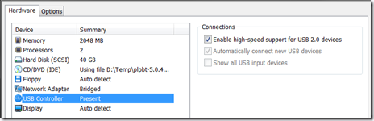

I ‘am testing an unattended installation of VMware ESXi from an USB drive. After every change, I needed to test if the unattended still worked. I tried to use VMware workstation to test the unattended installation. VMware Workstation doesn’t support boot from USB. There is an unofficial solution to fix this problem by using the PLOP boot manager ([Download link](http://www.plop.at/)). The PLOP Boot Manager is a small program to boot different operating systems. You can boot the operating systems from **harddisk**, **floppy**, **CD/DVD** or from **USB**.

**Steps to boot from USB:**

- Download the BLOP boot manager
- Add a USB controller to the VM and select Automatically connect new USB devices.

[]

- Attach the PLOP boot manager image as floppy- or CD image
- Boot the VM in PLOP
- Insert the USB stick and select USB

[]

Sometimes the USB device is not detected at once, reboot the VM once more and it should work.

With PLOP it is possible to use USB boot VMware Workstation.

Credits goes to Uli Hankeln from [http://sanbarrow.com](http://sanbarrow.com), thanks for pointing me to this boot manager.