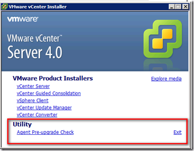
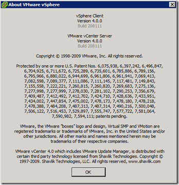
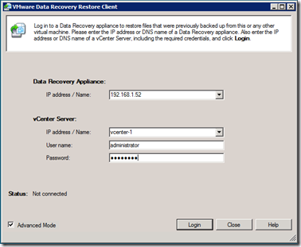
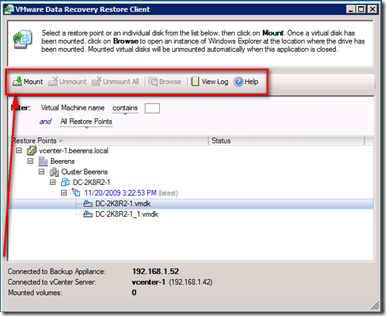
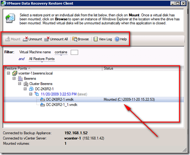
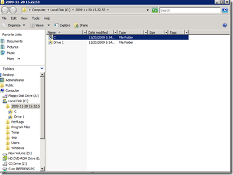
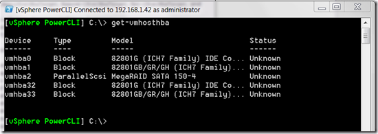

Today when i woke up there where a lot of VMware updates available (to much to handle for one day 🙂 ). I did an upgrade of my lab environment, it went smooth with any issues. VMware did a great job with the new improvements! Here’s a list of improvements with some screenshots:

## VMware ESX 4 Update 1 improvements:

> **VMware View 4.0 support** **–** This release adds support for VMware View 4.0, a solution built specifically for delivering desktops as a managed service from the protocol to the platform.
> 
> **Windows 7 and Windows 2008 R2 support –** This release adds support for 32-bit and 64-bit versions of Windows 7 as well as 64-bit Windows 2008 R2 as guest OS platforms. In addition, the vSphere Client is now supported and can be installed on a Windows 7 platform. For a complete list of supported guest operating systems with this release, see the [_VMware Compatibility Guide_](http://www.VMware.com/resources/compatibility/search.php).
> 
> **Enhanced Clustering Support for Microsoft Windows –** Microsoft Cluster Server (MSCS) for Windows 2000 and 2003 and Windows Server 2008 Failover Clustering is now supported on a VMware High Availability (HA) and Dynamic Resource Scheduler (DRS) cluster in a limited configuration. HA and DRS functionality can be effectively disabled for individual MSCS virtual machines as opposed to disabling HA and DRS on the entire ESX/ESXi host**.** Refer to the _Setup for Failover Clustering and Microsoft Cluster Service_ guide for additional configuration guidelines.
> 
> **Enhanced VMware Paravirtualized SCSI Support** **–** Support for boot disk devices attached to a Paravirtualized SCSI ( PVSCSI) adapter has been added for Windows 2003 and 2008 guest operating systems. Floppy disk images are also available containing the driver for use during the Windows installation by selecting F6 to install additional drivers during setup. Floppy images can be found in the /vmimages/floppies/ folder.
> 
> **Improved vNetwork Distributed Switch Performance** **–** Several performance and usability issues have been resolved resulting in the following:
> 
> - Improved performance when making configuration changes to a vNetwork Distributed Switch (vDS) instance when the ESX/ESXi host is under a heavy load
> - Improved performance when adding or removing an ESX/ESXi host to or from a vDS instance  
>     
> **Increase in vCPU per Core Limit** **–** The limit on vCPUs per core has been increased from 20 to 25. This change raises the supported limit only. It does not include any additional performance optimizations. Raising the limit allows users more flexibility to configure systems based on specific workloads and to get the most advantage from increasingly faster processors. The achievable number of vCPUs per core depends on the workload and specifics of the hardware. For more information see the _[Performance Best Practices for VMware vSphere 4.0](http://www.VMware.com/pdf/Perf_Best_Practices_vSphere4.0.pdf)_ guide.
> 
> **Enablement of Intel Xeon Processor 3400 Series** – Support for the Xeon processor 3400 series has been added. For a complete list of supported third party hardware and devices, see the [_VMware Compatibility Guide_](http://www.VMware.com/resources/compatibility/search.php).  
>   
> The new VMware ESX 4 update 1 build is 208167

 

## VMware vCenter Server 4.0 Update 1 improvements:

> - **IBM DB2 Database Support for vCenter Server** — This release adds support for IBM DB2 9.5 as the backend database platform for VMware vCenter Server 4.0. The following editions of IBM DB2 are supported:
> 
> - IBM DB2 Enterprise 9.5
> - IBM DB2 Workgroup 9.5
> - IBM DB2 Express 9.5
> - IBM DB2 Express-C 9.5
> 
> - **VMware View 4.0 support** — This release adds support for VMware View 4.0, a solution built specifically for delivering desktops as a managed service from the protocol to the platform.
> - **Windows 7 and Windows 2008 R2 support** — This release adds support for 32-bit and 64-bit versions of Windows 7 as well as 64-bit Windows 2008 R2 as guest operating system platforms. In addition, the vSphere Client is now supported and can be installed on a Windows 7 platform.
> - **Pre-Upgrade Checker Tool** — A standalone pre-upgrade checker tool is now available as part of the vCenter Server installation media that proactively checks ESX hosts for any potential issues that you might encounter while upgrading vCenter agents on these hosts as part of the vCenter Server upgrade process. You can run this tool independently prior to upgrading an existing vCenter Server instance. The tool can help identify any configuration, networking, disk space or other ESX host-related issues that could prevent ESX hosts from being managed by vCenter Server after a successful vCenter Server upgrade.
> 
> 
> 
> - **HA Cluster Configuration Maximum** — HA clusters can now support 160 virtual machines per host in HA Cluster of 8 hosts or less. The maximum number of virtual machines per host in cluster sizes of 9 hosts and above is still 40, allowing a maximum of 1280 Virtual Machines per HA cluster.

The new vCenter version and build is 4.0.0 build 208111

### When choosing for Operating System for the vCenter server keep the following in your mind:

> Future releases of VMware vCenter Server might not support installation on 32-bit Windows operating systems. **VMware recommends installing vCenter Server on a 64-bit Windows operating system.** If you have VirtualCenter 2.x installed, see the vSphere Upgrade Guide for instructions on installing vCenter Server on a 64-bit operating system and preserving your VirtualCenter database.

## VMware Data Recovery (vDR) version 1.1 improvements:

> **File Level Restore Functionality is Officially Supported**
> 
> - File Level Restore (FLR) provides a way to access individual files within restore points for Windows virtual machines. In previous versions of Data Recovery, FLR was provided as an experimental feature. File Level Restore feature is now officially supported.
>     
> - **Integrity Check Stability and Performance Improved**
>     
>     The integrity check process is faster and more stable. Note that integrity checks are computationally intensive processes and can take significant periods of time. The exact amount of time integrity checks take varies based on of the size of the deduplication store. Even with these enhancements, integrity checks that take several hours are not unexpected.
>     
> - **Integrity Checks Provides Improved Progress Information**
>     
>     When an integrity check is running, a progress indicator is displayed. This progress indicator has been improved, although it does not provide the optimal level of detail.
>     
> - **Enhanced CIFS Shares Support**

File Level Restore (FLR) is a graphical client that can restore individual files.  Here are some screenshots of FLR:

 

## vSphere PowerCLI 4.0 Update 1 improvements:

> - Managing the failover and load-balancing policies of `VirtualSwitch` and `VirtualPortGroup` objects with `Get-NicTeamingPolicy` and `Set-NicTeamingPolicy`.
>     
> - Copying files in and out of guest operating systems with `Copy-VMGuestFile`.
>     
> - Restarting virtual machines with `Restart-VM`.
>     
> - Managing the power state of hosts using `Start-VMHost`, `Restart-VMHost`, `Suspend-VMHost`, and `Stop-VMHost`.
>     
> - Managing guest networks with `Get-VMGuestNetworkInterface`, `Set-VMGuestNetworkInterface`, `Get-VMGuestRoute`, `New-VMGuestRoute`, `Remove-VMGuestRoute`, and `Set-VMGuestRoute`.
>     
> - Retrieving and removing USB devices with `Get-UsbDevice` and `Remove-UsbDevice`.
>     
> - Managing NIC customization settings with `Get-OSCustomizationNicMapping`, `New-OSCustomizationNicMapping`, and `Set-OSCustomizationNicMapping`.
>     
> - Handling virtual machine questions with `Get-VMQuestion` and `Set-VMQuestion`.
>     
> - Working with host storages and iSCSI HBA devices with `Get-VMHostHba`, `Set-VMHostHba`, `Get-iScsiHbaTarget`, `New-iScsiHbaTarget`, `Remove-iScsiHbaTarget`, `Set-iScsiHbaTarget`, and `Set-VMHostStorage`.
>     
> - Moving templates with `Move-Template` and `Move-Inventory`.
>     
> - Managing the access control system with `Get-VIPrivilege`, `Get-VIRole`, `New-VIRole`, `Remove-VIRole`, `Set-VIRole`, `Get-VIPermission`, `New-VIPermission`, `Remove-VIPermission`, and `Set-VIPermission`.
>     
> - Managing DRS recommendations with `Get-DrsRecommendation` and `Apply-DrsRecommendation`.
>     
> - Upgrading hosts with `Install-VMHostPatch`.
>     
> - Managing virtual appliances with `Get-VApp`, `Export-VApp`, `Import-VApp`, `New-VApp`, `Remove-VApp`, `Set-VApp`, `Start-VApp`, and `Stop-VApp`.
>     
> - Managing PCI and SCSI passthrough devices with `Add-PassthroughDevice`, `Get-PassthroughDevice`, and `Remove-PassthroughDevice`.
>     
> - Running BAT (Windows) and BASH (Linux) scripts with `Invoke-VMScript`.
>     
> - Granting and revoking shell access with `New-VMHostAccount` and `Set-VMHostAccount`.
>     
> - Uploading firmware packages with `Set-VMHostFirmware`.
>     
> - Creating virtual machines with thin provisioned disks with `New-VM`.
>     
> - Cloning powered-on virtual machines with `New-VM`.
>     
> - Resizing virtual disks and guest partitions with `Set-HardDisk`.
>     
> - Extending, cloning, inflating, and reallocating virtual hard disks with `Copy-HardDisk, New-HardDisk,` and `Set-HardDisk`.
>     
> - Managing the host time zones with `Get-VMHostAvailableTimeZone` and `Set-VMHost`.
>     
> - Working with default Datastore Provider and Inventory Provider drives.
>     
> - Working with files and directories in datastores by using the Datastore Provider.
>     

## VMware vCenter Server Heartbeat 5.5 Update 2 improvements:

> The features available depend on the version of vCenter Server installed.
> 
> - **Support for Windows Server 2008 SP1 and SP2 (x86/x64)** — VMware vCenter Server Heartbeat now supports running on Windows Server 2008 SP1 and SP2 (including x86 and x64 versions) operating systems.
> - **Support for Windows Server 2003 Enterprise SP2 (x64)** — VMware vCenter Server Heartbeat now supports running on the Windows Server 2003 Enterprise SP2 (x64) operating system.
> - **Protection of VMware vCenter Management Web Services** — This release of VMware vCenter Server Heartbeat adds the vCenter Management Web Server to its list of protected vCenter Server components.
> - **Introduction of the WinZip Self-Extracting executable file for Setup** — Installation and setup of VMware vCenter Server Heartbeat is initiated through the use of a WinZip Self-Extracting executable file.
> - **60-day evaluation mode** — This release of VMware vCenter Server Heartbeat provides a built-in 60-day evaluation mode that is triggered from the date of installation. Either prior to or upon expiration of the 60-day evaluation period, administrators will need to provide a valid license key to continue to leverage VMware vCenter Server Heartbeat functionality.
> - **Tomcat Monitoring Rule** — A new rule has been added for vCenter 4.0 Tomcat Web Server availability.
> 
> **Note:** The term vSphere Client is applicable to both vSphere Client and VI Client except where VI Client is specifically stated.

The next new version will probably the View 4 release on Monday.