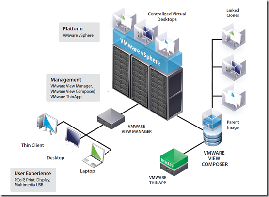
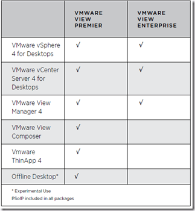

Today VMware has View 4 announced. VMware View 4 is supported on VMware vSphere and has a new protocol named PCoIP (View 3 uses RDP).

 

Here’s a list of new and/or improved features:

<table dir="ltr" border="1" cellspacing="0" cellpadding="9" width="613"><tbody><tr><td width="33%" height="14" valign="top"><strong>FEATURE</strong>&nbsp;&nbsp;

&nbsp;

</td><td width="40" height="14" valign="top"><strong>NEW/IMPROVED</strong>&nbsp;&nbsp;

&nbsp;

</td><td width="369" height="14" valign="top"><strong>DESCRIPTION</strong>&nbsp;&nbsp;

&nbsp;

</td></tr><tr><td width="33%" height="43" valign="top">Quad monitor support&nbsp;&nbsp;

&nbsp;

</td><td width="40" height="43" valign="top">
New

&nbsp;

&nbsp;

&nbsp;

</td><td width="369" height="43" valign="top">Support 32-bit color with <strong>1920 x 1200</strong> display resolution and up to 4 monitors simultaneously.Benefit: True multiple displays allow you to "see more and do more" from a full desktop. This provides the ability to reproduce true color images with support for up to 4.2 billion distinct colors per pixel.&nbsp;

&nbsp;

&nbsp;

</td></tr><tr><td width="33%" height="43" valign="top">True multi-monitor support on L-shape configuration&nbsp;&nbsp;

&nbsp;

</td><td width="40" height="43" valign="top">
New

&nbsp;

&nbsp;

&nbsp;

</td><td width="369" height="43" valign="top">Support 1 landscape display and 1 portrait display (with pivot monitors), variable resolution support, and auto fit to client.Benefit: Each monitor can be of a different size and be set to a different resolution. Auto Display Scaling/Dynamic Resizing helps desktop publishing, financial application, and high-end graphic design needs.&nbsp;

&nbsp;

&nbsp;

</td></tr><tr><td width="33%" height="62" valign="top">Guest desktop support <strong>Windows Vista and XP OS</strong>&nbsp;&nbsp;

&nbsp;

</td><td width="40" height="62" valign="top">
New

&nbsp;

&nbsp;

&nbsp;

</td><td width="369" height="62" valign="top">Support for connecting to virtual desktops from Windows XP and Vista. The VMware View 4 PCoIP is a software-to-software implementation. However, it also supports hardware PCoIP hosts such as the Samsung SyncMaster 930ND 19" monitor and Teradici Tera Portal.
http://www.teradici.com/pcoip/pcoip-products/oem-solutions.php

&nbsp;

Benefit: Provides scalable support to both software and hardware on the local hosts.

&nbsp;
&nbsp;

&nbsp;

&nbsp;

&nbsp;

</td></tr><tr><td width="33%" height="26" valign="top">Network characteristics and security&nbsp;&nbsp;

&nbsp;

</td><td width="40" height="26" valign="top">
New

&nbsp;

&nbsp;

&nbsp;

</td><td width="369" height="26" valign="top">SSL protection on TCP for session management and AES 128-bit key encryption on UDP for media transfer between host and client system.Benefit: Provides comparable security and encryption found in other protocols.&nbsp;

&nbsp;

&nbsp;

</td></tr><tr><td width="33%" height="35" valign="top">Protocol intelligence&nbsp;&nbsp;

&nbsp;

</td><td width="40" height="35" valign="top">
New

&nbsp;

&nbsp;

&nbsp;

</td><td width="369" height="35" valign="top"><strong>PCoIP protocol provides the intelligence to handle prioritization and quality of services (QOS) for video/mouse/keyboard/sound, etc.</strong>Benefit: This greatly helps the user experience by managing bandwidth and content variables.&nbsp;

&nbsp;

&nbsp;

</td></tr><tr><td width="33%" height="16" valign="top">WAN performance and optimization&nbsp;&nbsp;

&nbsp;

</td><td width="40" height="16" valign="top">
New

&nbsp;

&nbsp;

&nbsp;

</td><td width="369" height="16" valign="top"><strong>Operate with up to 250ms of round-trip latency with tolerance on packet loss up to 5%.</strong>&nbsp;&nbsp;

&nbsp;

</td></tr><tr><td width="33%" height="7" valign="top">VPN tunneling&nbsp;&nbsp;

&nbsp;

</td><td width="40" height="7" valign="top">
New

&nbsp;

&nbsp;

&nbsp;

</td><td width="369" height="7" valign="top">Support Cisco VPN soft client.&nbsp;&nbsp;

&nbsp;

</td></tr><tr><td width="33%" height="33" valign="top">RDP virtual channel compatibility for USB redirection&nbsp;&nbsp;

&nbsp;

</td><td width="40" height="33" valign="top">
New

&nbsp;

&nbsp;

&nbsp;

</td><td width="369" height="33" valign="top">Support the comparable list of USB peripherals including biometrics, card readers, webcams, mass storage, flash devices, scanners, etc. The authorization can be done on a per-user/per-group basis to only accept specific devices.&nbsp;&nbsp;

&nbsp;

</td></tr><tr><td width="33%" height="69" valign="top"><strong>Flash control support for PCoIP</strong>&nbsp;&nbsp;

&nbsp;

</td><td width="40" height="69" valign="top">
New

&nbsp;

&nbsp;

&nbsp;

</td><td width="369" height="69" valign="top"><strong>PCoIP uses breakthrough graphics compression that is custom built for delivering a user desktop over IP</strong> networks. It works in such a way as to support all graphics (full-frame rate 3D for design engineering, video gaming, etc.), and media (HD video, Microsoft video formats, YouTube, Microsoft Silverlight, Google, QuickTime, or Adobe Flash).Benefit: By compressing the display image at the host PC/Server, you avoid application interoperability issues that have plagued thin clients for years and can quickly adapt to physical networks.&nbsp;

&nbsp;

&nbsp;

</td></tr><tr><td width="33%" height="16" valign="top">Audio redirection&nbsp;&nbsp;

&nbsp;

</td><td width="40" height="16" valign="top">
New

&nbsp;

&nbsp;

&nbsp;

</td><td width="369" height="16" valign="top">New to PCoIP protocol. Redirect audio with dynamic audio quality adjustment on the WAN.&nbsp;&nbsp;

&nbsp;

</td></tr><tr><td width="33%" height="16" valign="top">ClearType font&nbsp;&nbsp;

&nbsp;

</td><td width="40" height="16" valign="top">
New

&nbsp;

&nbsp;

&nbsp;

</td><td width="369" height="16" valign="top">Subpixel rendering technology which may help to improve the apperance of text on some computer displays. Newly added to PCoIP protocol&nbsp;&nbsp;

&nbsp;

</td></tr></tbody></table>

<table dir="ltr" border="1" cellspacing="0" cellpadding="9" width="612"><tbody><tr><td width="201" height="35" valign="top">Full clone pool with thin disk/thin provisioning&nbsp;&nbsp;

&nbsp;

</td><td width="122" height="35" valign="top">
New

&nbsp;

&nbsp;

&nbsp;

</td><td width="287" height="35" valign="top">VMware View 4 provides seamless native support for thin provisioning with the vSphere server.Benefit: Helps reduce storage usage and allows more guest desktops per core while still providing high performance.&nbsp;

&nbsp;

&nbsp;

</td></tr><tr><td width="201" height="42" valign="top">Mixed cluster support for backward – forward compatibility&nbsp;&nbsp;

&nbsp;

</td><td width="122" height="42" valign="top">
New

&nbsp;

&nbsp;

&nbsp;

</td><td width="287" height="42" valign="top">This new option in View Administrator allows different versions of clusters to be managed via the same UI.&nbsp;&nbsp;

&nbsp;

</td></tr><tr><td width="201" height="33" valign="top">VWware VMsafe API for better anti-virus optimization and execution&nbsp;&nbsp;

&nbsp;

</td><td width="122" height="33" valign="top">
New

&nbsp;

&nbsp;

&nbsp;

</td><td width="287" height="33" valign="top">VMware vSphere supports VMware VMsafe™ API Security virtual machine deployment, sold separately by security vendors, is consistent with desktop deployment. Protects the virtual machine by inspecting virtual components (CPU, Memory, Network and Storage).&nbsp;&nbsp;

&nbsp;

</td></tr></tbody></table>

<table dir="ltr" border="1" cellspacing="0" cellpadding="9" width="614"><tbody><tr><td width="199" height="35" valign="top">Triple single sign — on (3SSO) for sessions/connections keep-alive&nbsp;&nbsp;

&nbsp;

</td><td width="124" height="35" valign="top">
Improved

&nbsp;

&nbsp;

&nbsp;

</td><td width="289" height="35" valign="top">This setting enables "log in as current user" using Active Directory credentials or smart cards over Remote Desktop Protocol.Benefit: Helps eliminate redundant authentication steps or double PIN entry when using smart cards.&nbsp;

&nbsp;

&nbsp;

</td></tr><tr><td width="199" height="24" valign="top">Tag-based pool access&nbsp;&nbsp;

&nbsp;

</td><td width="124" height="24" valign="top">
New

&nbsp;

&nbsp;

&nbsp;

</td><td width="289" height="24" valign="top">Administrators can now assign "tags" to connect server and desktop pools. Tag matching rules can be applied to restrict or grant users access to certain desktops.&nbsp;&nbsp;

&nbsp;

</td></tr><tr><td width="199" height="16" valign="top">Smart card removal policy&nbsp;&nbsp;

&nbsp;

</td><td width="124" height="16" valign="top">
Improved

&nbsp;

&nbsp;

&nbsp;

</td><td width="289" height="16" valign="top">This policy setting forces desktops to disconnect when users remove their smart card.&nbsp;&nbsp;

&nbsp;

</td></tr><tr><td width="199" height="16" valign="top">Delete script&nbsp;&nbsp;

&nbsp;

</td><td width="124" height="16" valign="top">
Improved

&nbsp;

&nbsp;

&nbsp;

</td><td width="289" height="16" valign="top">This scripting capability cleanly deletes VMware View desktops and allows extensibility using visual basic scripting.&nbsp;&nbsp;

&nbsp;

</td></tr></tbody></table>

VMware View is available in two editions:

**Offline desktop and Windows 7 support is experimental**. This means it is not ready for production environments! There is a HCL for Thin clients that supports View, click here for the [HCL](http://www.VMware.com/resources/compatibility/search.php?action=base&deviceCategory=vdm). VMware View will be released and available for download on 19 November 2009.
