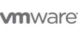

After attending the VMware View 4 Talkshoe podcast the following information about the announced VMware View 4 was discussed:
### VM’s per core:

VM’s per core, In VMware View 3 the number was 6-9 VM’s per core, now in View 4 with for example the Intel Nehalem processors you can get to 12-16 VM’s per core. This number heavily depends for example on the application load inside the VM’s.

### The PCoIP protocol does NOT support:
- Security Server;
- Smart Cards integration;
- Thinprint support.

### Generally:
- The PCoIP protocol is not different in scalability than RDP;
- For the RDP protocol version 6 is used in VMware VIEW;
- Offline desktop support is still experimental;
- There’s no RTO Software Virtual Profiles in this release of VMware VIEW 4;
- Windows  7 is still experimental, official support will be around the begin of 2010; 
- The Connection server must be installed on Windows 2003, support for Windows 2008 will be around the begin of 2010;
- Advise for virus scanning software is use VMware aware virus scanners (VMsafe), for example Trend Micro and McAfee have beta’s that use the VMsafe technology.

 | 