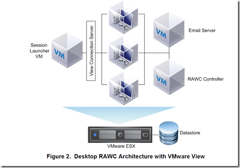
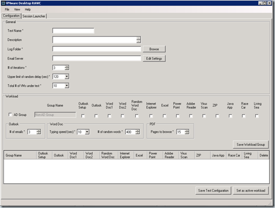

VMware released last week the desktop Reference Architecture Workload Simulator (RAWC).

When validating VMware View designs it is important to simulate real world usage as closely as possible. The _Desktop Reference Architecture Workload SImulator_ (RAWC) can be used to simulate a user workload in a typical Microsoft Windows® desktop environment.

Desktop RAWC runs on a Windows XP guest operating system and is executed on each desktop virtual machine (VM) on one or more ESX™ hosts. Each target desktop VM is equipped to run a RAWC workload that simulates typical user behavior, running an application set commonly used across a broad array of desktop environments.

[]

The workload has a set of randomly executed functions that perform operations on a variety of applications. Each test is configured using the Desktop RAWC UI

[]

The UI enables you to save and retrieve test parameters, create log folders, and define unique workloads based on Active Directory groups. You can use the UI to increase the load or adjust the user behavior, such as the number of words per minute that are typed and the delay between applications being launched.

The workload configuration typically used includes Microsoft Word, Excel, PowerPoint, Outlook, Internet Explorer, Windows Media Player, Java, Adobe Acrobat, McAfee Virus Scan, and 7-Zip. During the execution of the workload, multiple applications are opened at the same time and windows are minimized and maximized as the workload progresses, randomly switching between each application. Individual application operations that are randomly performed can include:
- Microsoft Word – Open, minimize, maximize, close, insert text, save modifications
- Microsoft Word (Random) – Open, minimize, maximize, close, write random words/numbers, save modifications
- Microsoft Excel – Open, minimize, maximize, close, write random numbers, insert/delete columns/rows, copy/paste formulas, save modifications
- Microsoft PowerPoint – Open, minimize, maximize, close, conduct a slide show presentation
- Microsoft Outlook – Open, minimize, maximize, close, create/send emails
- Internet Explorer – Open, minimize, maximize, close, browse page
- Windows Media Player – Open, close, view a video
- Java – Compile a java project comprised of several hundred files using the JDK to create a software
- engineering type of workload
- Adobe Acrobat Reader – Open, minimize, maximize, close, browse pages in PDF document
- McAfee Anti-virus – Real time scanning
- 7-Zip – Open, close, compress a large file

The RAWC kit is available for download from  the VMware partner central website.