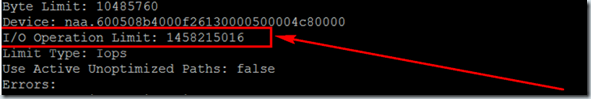

To get your HP EVA storage system  and VMware ESX hosts storage balances you get a better performance. Here are some Best practices.

The VMware vSphere and the HP EVA 4x00, 6x00 and 8x00 series are ALUA compliant. ALUA compliant means in simple words that it is not needed to manually identify preferred I/O paths between VMware ESX hosts and the storage controllers.

When you create a new Vdisk on the HP EVA the LUN is set default set to No Preference. The No Preference policy means the following: 
- Controller ownership is non-deterministic. The unit ownership is alternated between controllers during initial presentation or when controllers are restarted
- On controller failover (owning controller fails), the units are owned by the surviving controller
- On controller failback (previous owning controller returns), the units remain on the surviving controller. No failback occurs unless explicitly triggered.

To get a good distribution between the controllers the following Vdisk policies can be used:

**Path A-Failover/failback**

– At presentation, the units are brought online to controller A
– On controller failover, the units are owned by the surviving controller (B)
– On controller failback, the units are brought online on controller A implicitly.

**Path B-Failover/failback**

– At presentation, the units are brought online to controller B
– On controller failover, the units are owned by surviving controller (A)
– On controller failback, the units are brought online on controller B implicitly.

On the HP EVA half of the Vdisks are set on path A-Failover/failback and the other half  of the Vdisks are set to B-Failover/failback, so that they alternate between controller A and B. This can be done from the HP EVA command view.  Now the vDisk are distributed between the two controllers we can go to the vSphere configuration. On every vSphere host perform an rescan or reboot.

In VMware vSphere the Most Recently Used (MRU) and Round Robin (RR) multi-pathing policies are ALUA compliant. Round Robin load balancing is now officially supported.  These multi-path policies have the following characteristics:

**MRU:**
– Will give preference to an optimal path to the LUN
– When all optimal paths are unavailable, it will use a non-optimal path
– When an optimal path becomes available, it will failover to the optimal
– Although each ESX server may use a different port through the optimal controller to the LUN, only a single controller port is used for LUN access per ESX server

**Round Robin:**
– Will queue I/O to LUNs on all ports of the owning controllers in a round robin fashion providing instant bandwidth improvement
– Will continue queuing I/O in a round robin fashion to optimal controller ports until none are available and will failover to the non-optimal paths
– Once an optimal path returns it will failback to it
– Can be configured to round robin I/O to all controller ports for a LUN by ignoring optimal path preference. (May be suitable for a write intensive environment due to increased controller port bandwidth)

The fixed multi-path policy is not ALUA compliant and therefore not recommend to use. In vSphere 4 there is new multi-pathing framework. There are three core components:
- Native Multi-pathing Plugin (NMP), handles the multi-pathing configuration, communicates with the SATP and PSP to indentify path failure conditions.
- Storage Array Type Plugin (SATP), handles specific operations such as device discovery, error codes and failover.
- Path Selection Plugin (PSP), handles the best available path, there are three policies fixed, MRU and Round Robin.

PSP are set per LUN, meaning that it is possible to have some LUNs use MRU and other use Round Robin policy. Best practice from HP is to change to PSP from MRU to Round Robin we use the following command in the Service Console:

```
esxcli nmp satp setdefaultpsp --satp VMW\_SATP\_ALUA --psp VMW\_PSP\_RR
```

Another Best practice is to set the IOPS (Default the IOPS value is 1000) with a value of 1 (controls how many IOs are sent down a given path before vSphere starts to use the next path) for every LUN by using the following command:

```
for i in \`ls /vmfs/devices/disks/ | grep naa.600\` ; 
do esxcli nmp roundrobin setconfig --type "iops" --iops\=1 --device $i ;done
```

But there is a bug when rebooting the VMware ESX server, the IOPS value reverted to a random value. More information can be found on the [Virtual Geek](http://virtualgeek.typepad.com/virtual_geek/2009/12/vSphere-4-nmp-rr-iooperationslimit-bug-and-workaround.html) blog from Chad Sakac. To check the IOPS values on all LUNs use the following command:

```
for i in \`ls /vmfs/devices/disks/ | grep naa.600\` ;
do esxcli nmp roundrobin getconfig --device $i ;done
```

[]

To solve this IOPS bug, edit the /etc/rc.local file on every VMware ESX host and and add the  IOPS=1 command. The rc.local file execute after all init scripts are executed.

[](images/clip_image0025.jpg)[![clip_image002[5]](images/clip_image0025_thumb1.jpg "clip_image002[5]")](https://www.ivobeerens.nl/wp-content/uploads/2012/01/clip_image00251.jpg)

After adding the IOPS=1 command restart the VMware ESX host and check the IOPS values when its back online.

[![clip_image002[7]](images/clip_image0027_thumb.jpg)]

Now you can check if the the Round Robin policy is active and the LUNs are spread over the two controllers.