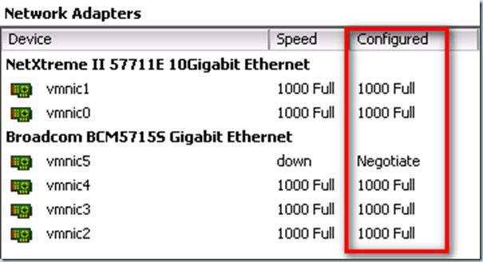
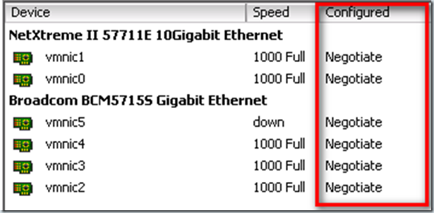

When you install VMware ESX 4 by using the default installation method from for example the DVD, the NIC speed and duplex setting are set to fixed for each NIC. This means that the network switch port must be set to fixed too. In VMware ESX 3 the default NIC mode was Auto Negotiate In the vCenter clients this looks like:

[]

You can easily change the NIC speed and duplex settings to auto Negotiate for all NICs in the ESX host by using PowerCLI. This can be done by using the  following one-liner: 
```
Get-VMHostNetworkAdapter | Set-VMHostNetworkAdapter –AutoNegotiate
```
**Be sure when you execute this command in production environment, that the VMware ESX hosts is in maintenance mode!**

[]