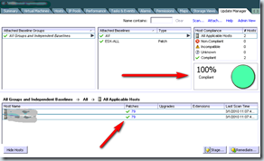
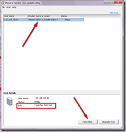
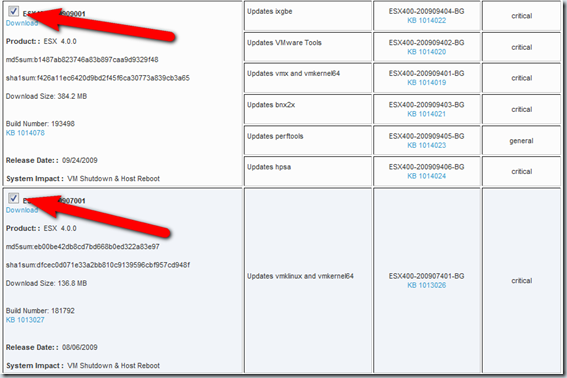
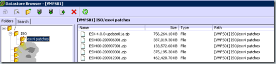

There are different ways to patch your VMware ESX(i) 4 hosts. The most common utilities are VMware Update Manager (VUM), vSphere Host Update Utility and the esxupdate command line utility (run from the Service Console) to patch your VMware environment. Here’s explained the differences between them.

**VUM** can be used to automated patch your complete environment without user intervention. ESX(i) host are automatically placed in maintenance mode and VM’s are migrated to other VMware ESX(i) host using VMotion and DRS techniques, the host is patched, rebooted and exiting maintenance mode.  VUM is used on enterprise environments.

**vSphere Host Update Utility** can be used to patch only VMware ESXi (not ESX) hosts. Normally this utility is used in small ESXi environments without VUM, VMotion and DRS.
<table border="0" cellspacing="0" cellpadding="2" width="586"><tbody><tr><td valign="top" width="273"><p align="center"><a href="images/image12.png"></a>&nbsp;<br>&nbsp;<br><br><br><br><br><br></p></td><td valign="top" width="311"><a href="https://www.ivobeerens.nl/wp-content/uploads/2010/03/image8.png"></a></td></tr><tr><td valign="top" width="273">VUM utility</td><td valign="top" width="311">vSphere Host Update Utility<font color="#3672a1"></font></td></tr></tbody></table>

**ESXupdate** command, this command line utility (in the service console) can be used to patch your standalone VMware ESX host, for example the vSphere Essentials edition. This small business version comes with for example VMware ESX, vCenter and VMware Update Manager. But when your vCenter server is installed virtually as VM you are not able to transfer the VM to another host because there is no VMotion in the license. All the VMs must be shutdown including the vCenter VM to put the host in maintenance mode. So you can’t use VMware Update Manager. Now you need the esxupdate command.  Here are the steps for using the ESXupdate command:

- The first thing is to download the patch bundles. A bundle contains a metadata zip which defines the bulletins available for installation. This is a great improvement to earlier versions of VMware ESX. It’s possible to select all patch bundles and download them at once. The patch bundles can be found [here](https://www.VMware.com/mysupport/download/).

[]

- Upload the patch bundles on the VMware ESX VMFS  or NFS partition (other options such as HTTP repository are also possible). This can be done by using the datastore browser in the vCenter client.

 []

- Shutdown all VMs on the VMware ESX host to patch using the .vSphere client or the VMware-cmd command.
- Put the host in maintenance mode using the vSphere client or the following command:
```
vimsh -n -e /hostsvc/maintenance\_mode\_enter
```
- Check the integrity of the patch bundle with the esxupdate –check –bundle command. Do this for all patch bundles.
- Install the patch using the esxupdate update –bundle command. Install all patch bundles beginning with the oldest patch bundle.
- Exit maintenance mode by using the vSphere client of the following command:
```
vimsh -n -e /hostsvc/maintenance\_mode\_exit
```
- Reboot the hosts vSphere client of the following command:
```
shutdown –r now
```
Here’s a sample script:
```
vimsh -n -e /hostsvc/maintenance\_mode\_enter
esxupdate check --bundle ESX400-200906001.zip
esxupdate update --bundle ESX400-200906001.zip
esxupdate check --bundle ESX400-200907001.zip
esxupdate update --bundle ESX400-200907001.zip
esxupdate check --bundle ESX400-200909001.zip
esxupdate update --bundle ESX400-200909001.zip
esxupdate check --bundle ESX-4.0.0-update01a.zip
esxupdate update --bundle ESX-4.0.0-update01a.zip
esxupdate check --bundle ESX400-200912001.zip
esxupdate update --bundle ESX400-200912001.zip
esxupdate check --bundle ESX400-201002001.zip
esxupdate update --bundle ESX400-201002001.zip
vimsh -n -e /hostsvc/maintenance\_mode\_exit
shutdown -r now
```