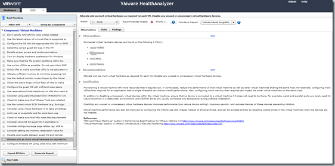

VMware HealthAnalyzer automates the collection of VMware Infrastructure or VMware vSphere™ inventory, configuration and utilization data, analyzes data and recommends grades, and generates a report card that presents observations, findings and data categorized by VMware Health Check best practices. HealthAnalyzer can be used by VMware consultants and VMware Solution Providers to improve efficiency and accelerate the delivery of a services engagement such as the VMware Health Check. Consultants can use HealthAnalyzer as a Health Check workbench to capture and review observations, findings, and data, provide actionable recommendations, and generate a Health Check Report for your customer.

**What’s new in VMware HealthAnalyzer version 3.0:**
- A new catalog of best practices developed for VMware vSphere
- Observations tab presents observations (summary of findings),recommendations and a justification for each analyzed best practice area
- Enhanced best practices navigation pane that provides powerful filtering and grouping capabilities
- Collection of VMware VirtualCenter/vCenter diagnostics data
- New Virtual Appliance Web Console Management User Interface
- Support for running the HealthAnalyzer virtual application on Windows 7
- Base Health Check mode enables use of HealthAnalyzer as a presales tool
- Select observations/BP to include in the Health Check report
- New Health Check Report
- A new catalog of best practices developed for VMware vSphere

VMware HealthAnalyzer 3.0 is available at the VMware partner central.

