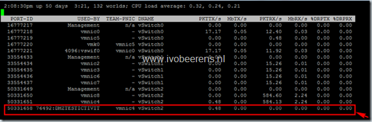

During a health check of a vSphere environment i notices dropped packets on several VMs. In ESXTOP the %DRPRX value showed dropped receive packets on several VMs. In the screenshot an example:

The customer uses vSphere 4.0 build 244038. All the VMs that experiencing the dropped packets problem were Windows 2008 with an  **E1000** NIC.

> **E1000** — An emulated version of the Intel 82545EM Gigabit Ethernet NIC. A driver for this NIC is not included with all guest operating systems. Typically Linux versions 2.4.19 and later, Windows XP Professional x64 Edition and later, and Windows Server 2003 (32-bit) and later include the E1000 driver.

On of the Windows 2008 VMs had no packets drops. The only difference with the other VMs was that the IPv6 protocol binding on the NIC was disabled. After disabling the IPv6 protocol binding on all the other VMs the packet drops is disappear.

Some services require the IPv6 binding, so disabling the IPv6 binding was no option for the customer.  All the other Windows 2008 machines with the VMXNET3 NIC and IPv6 enabled had no packet drops. After changing all the VMs with Windows 2008 and the E1000 NIC to the VMXNET3 NIC solves the problem.

> The VMXNET 3 adapter is the next generation of a paravirtualized NIC designed for performance, and is not related to VMXNET or VMXNET 2. It offers all the features available in VMXNET 2, and adds several new features like multiqueue support (also known as Receive Side Scaling in Windows), IPv6 offloads, and MSI/MSI-X interrupt delivery.

Whenever possible i suggest to use the VMXNET3 driver for Windows 2008 Operating Systems.