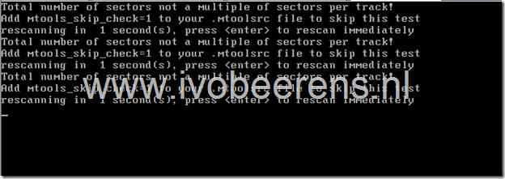

Not all servers nowadays have a DVD player installed. Sometimes it is handy to boot from USB and installing a single VMware ESXi server. Here’s a example how to make the USB stick bootable and install VMware ESXi 4.1 from it by using Windows.

**Preparation:**
- Need 1GB USB memory stick or more.
- Download the VMware ESXi 4.1 ISO named **VMware-VMvisor-Installer-4.1.0-260247.x86\_64.iso** (In this example I used the VMware vSphere Hypervisor version).

**UppubDate: The latest version of VMware ESXi is  4.1 Update 1 (VMware-VMvisor-Installer-4.1.0.update1-348481.x86\_64.iso). It solves the “Total number of sectors” bug in VMware ESXi 4.1. It is recommend to use this version so the “mod.tgz” workaround isn’t needed anymore!**

- Download Syslinux, can be found by clicking on the following [link](http://www.kernel.org/pub/linux/utils/boot/syslinux/). Download the latest Syslinux zip file (when writing this article  syslinux-4.02.zip was the latest).

**UppubDate: Also tested Syslinux version 4.03.**

Stick the USB stick on a  free USB port on your computer equipped with a Windows OS. For this example I used Windows7 as Operating System. Clear the USB stick and create a partition on it by using the following command’s:

- Open the command prompt and enter the following commands:
```
Diskpart (make sure you run diskpart as administrator)
list disk (list the disk in your system including the USB)select disk USB number
clean
create partition primary
active
format fs=fat32 quick
assign
exit
```

To make the USB stick bootable:
- Extract the Syslinux ZIP and browse to the the \\syslinux\\win32 folder,  execute “**syslinux \[drive letter USB stick\]**”, example **syslinux f:**
- Mount the ISO  and copy all the content of the VMware ESXi 4.1 ISO to the USB stick. For mounting the ISO, I used ‘Deamon Tools Lite’ tool.
- Rename the **isolinux.cfg** file to **syslinux.cfg**
- Edit the syslinux.cfg and add **ks=usb** and on the end of the append line **--- mod.tgz** (beware of the space between **---** and the **mod.tgz).**

**UppubDate: When using VMware ESXi 4.1 Update 1 the mod.tgz line doesn’t need to append!**

```
default menu.c32
menu title VMware VMvisor Boot Menu
timeout 80
label ESXi Installer

menu label ^ESXi Installer
kernel mboot.c32
append vmkboot.gz ks=usb --- vmkernel.gz --- sys.vgz --- cim.vgz --- ienviron.vgz --- install.vgz --- mod.tgz
label ^Boot from local disk

menu label ^Boot from local disk
localboot 0x80
```

- Create a **ks.cfg** file in the root from the UBS stick. For example:
```
rootpw VMware01
install usb
autopart --firstdisk --overwritevmfs
reboot

#Network install type

network --bootproto=static --addvmportgroup=false --device=vmnic0 --ip=192.168.1.10 --netmask=255.255.255.0 --gateway=192.168.1.1  --nameserver=192.168.1.1 --hostname=ESXi-01.beerens.local

accepteula

%firstboot --unsupported --interpreter=busybox

vim-cmd hostsvc/datastore/rename datastore1 "$(hostname -s)-local-storage-1"
```

- Copy the syslinux-4.02\\com32\\mboot\\**mboot.c32** file the USB stick (overwrite the old file on the USB stick) 

- Copy the syslinux-4.02\\com32\\menu\\**menu.c32** file the USB stick (overwrite the old file on the USB stick)

The bootable VMware ESXi 4.1 stick is ready for use. When booting  the USB stick the following message is displayed “**Total number of sectors not a multiple of sectors per track! Add mtools\_skip\_check=1 to your .mtoolsrc file to skip this test**”.

[](images/image1.png)

**UppubDate: When using VMware ESXi 4.1 Update 1 this bug is fixed. You’re ready to use the USB stick!**

On the VMware communities I found the following [post](http://communities.VMware.com/message/1621352). This post states a manual solution by using the following commands:
- Press ALT-F1
- Login by using the root account with no password
- **echo “mtools\_skip\_check=1”>.\\mtoolsrc**
- ALT+F2 and return to the orginal Console  window
- Press ENTER or wait to continue

To automate the above solution read the following blogpost “**VMware ESX 4.1 install using Western Digital USB Hard Drive”** . By using  this blogpost I created a mod.tgz file by using the following commands from a full installation of VMware ESXi 4.1:
- Login the VMware ESXi 4.1 console
- Make a directory in the root for example mkdir temp
- cd temp
- mkdir –p etc/VMware/init/init.d/
- cd etc/VMware/init/init.d/
- vi 47.mtoolshack
```
echo "mtools\_skip\_check=1" >/.mtoolsrc
return ${SUCCESS}
```

- Save the fi using the command **:wq** in VI
- cd /temp
- tar czvf mod.tgz etc
- SCP the file **mod.tgz** file to the USB stick

The mod.tgz can also downloaded, so the above steps can be skiped. On the end of this article is a download link for the mod.tgz.

The mod.tgz contains an init script which skips the mtools check. Now you’re ready to boot your server with the USB stick and your able to install  VMware ESXi 4.1. 

#### [Download mod.tgz](https://www.ivobeerens.nl/wp-content/uploads/mod.tgz)

**Update : When using VMware ESXi 4.1 Update 1 there is no need to add the mod.tgz because this bug is fixed.**