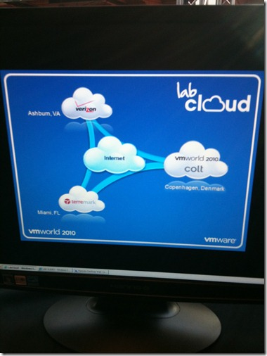
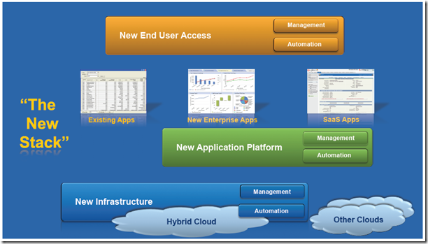

This week I visited Copenhagen for VMworld Europe 2010. With over 6000 attendees, 1300 more than last year in Cannes (France). On Monday there were partners sessions and in the afternoon is was already possible to do labs. VMware opened the labs earlier because of the overwhelming amount of VMware registrations.

The labs were hosted by the cloud providers Terremark (Miami) and Verizon (Ashburn). Via the Colt provider in England the access to the  both datacenters was possible. In Copenhagen VMware announced that Colt is the first European VMware vCloud datacenter service provider.

In total there were 30 labs with 23,5 hours of lab time and 240 seats with PCoIP enabled zero clients with dual monitor. All the 240 seats are able to deliver the every lab. This is  great improvements with earlier years of VMworld Europe.  I did around 10 labs. The best labs I found the two labs about VMware vCloud Director and vShield lab. The overall performance was good. The total amount of labs completed during VMworld is **5948!**

On Tuesday VMworld officially begins with the keynote (general session).  It was almost the same keynote as in San Francisco. So the ‘new’ announcements were limited! The keynote can be found by clicking the following [link](http://www.vmworld.com/community/conferences/europe2010/generalsessions).

This picture summarizes the keynote:

The keynote makes the direction of VMware for the coming years very clear.

There were a lot of breakout sessions during the three days. My personally top 5 sessions I attended are:

- SRM Futures: Failback Automation, Workload Mobility and More (Lee Dilworth and Jacob Jensen);
- Planning and Designing an HA Cluster that Maximizes VM Uptime (Duncan Epping, and Marc Sevigny);
- PowerCLI is for Administrators (Alan Renouf and Luc Dekens);
- Tech Preview: Storage DRS (Irfan Ahmad);
- Performance Best Practices for vSphere (Scott Drummonds and Kaushik Banerjee).

The Solution Exchange was filled with 113 exhibitors. I visited several boots during the three days and talked to vendors about their products.  In the evenings there were every day one of more parties.  My number one was the VMware Benelux party on Thursday in Club Nasa.  Great party!

Summarized I had good conversations, learned a lot  and met great people.  Looking already forward to VMworld 2011………………………………….