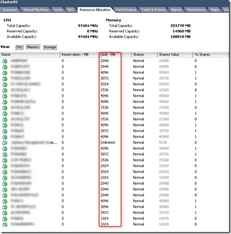

### Memory Limits ###

When adding existing VMware ESX servers (for example 3.5) to the VMware vCenter 4.1 server, all the VMs got a memory limit.

[](images/2010-12-10-12h39_01.jpg)

To reset the memory limits to unlimited for all VMs, use the following PowerCLI script:

```powershell
Connect-VIServer <servername>
Get-VM | Get-VMResourceConfiguration | Where-Object {$\_.MemLimitMB -ne ‘-1‘} | Set-VMResourceConfiguration -MemLimitMB $null 
```

### VMware ESX NICs as fixed

Already mentioned earlier in the “[Change NIC speed and duplex setting to AUTO in ESX4 using PowerCLI”](https://www.ivobeerens.nl/?p=537) blogpost. The VMware ESX installation set by default each NIC in the VMware hosts to fixed. To change every NIC from fixed to auto negotiate  use the following PowerCLI script

```powershell
Connect-VIServer <servername> 
Get-VMHostNetworkAdapter | Set-VMHostNetworkAdapter –AutoNegotiate
```

### Active Directory Web Services warnings in the vCenter server event log

The following warning is flooding the vCenter event log:

> Active Directory Web Services encountered an error while reading the settings for the specified Active Directory Lightweight Directory Services instance.  Active Directory Web Services will retry this operation periodically.  In the mean time, this instance will be ignored.

> Instance name: ADAM\_VMwareVCMSDS
> EventID: 1209

The Port SSL value is created as a REG\_SZ instead of a REG\_DWORD. To solve this warning open the Windows registry editor (regedt32) and browse to:
- HKLM\\System\\CurrentControlSet\\Services\\VMwareVCMSDS\\Parameter
- Delete the “Port SSL” value
- Create a new ““Port SSL” value  as REG\_DWORD and give it the data 636.
- Restart the ADM instance