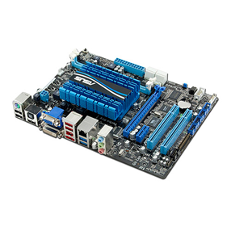
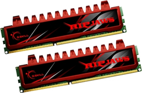
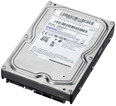
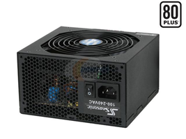
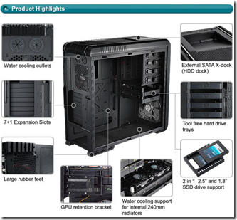
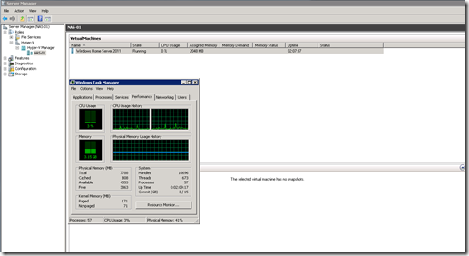

For my home lab i was looking for a home server with NAS functionality. My current Iomega IX2 (2x500GB) NAS is replaced by this server. For this server I had the following requirements

- Low power consumption (24x7)
- Low noise
- Flexibly and room to expand with extra hard drive(s),hardware RAID and a NIC
- Home server functionality for sharing photos, music, documents and films
- NAS functionality with iSCSI and NFS protocol
- FTP server
- Hypervisor enabled
- Backup server
- Print server 
- Active Directory
- DNS server
- Download server
- Wake-on-LAN functionality to start other virtualization hosts

I selected the following components:

#### **Motherboard**

Asus E35M1-M Pro. This motherboard contains  AMD Zacate E-350 1.60 GHz Dual-Core Processor.  It has TDP (Thermal Design Power) of **18W**!

[]

**Specifications:**

- Dual-core 1.60 GHz processor that has passive cooling.
- Onboard AMD Radeon graphic card
- USB 3.0
- 5 x SATA 6Gb/s
- EFI BIOS
- 2 x DIMM, Max 8GB RAM
- Realtek Gigabit  8111E LAN
- 1 x PCI Express 2.0, 1 x PCI Express 2.0 x1 slot, 2 x PCI 3.0 slots
- uATX Form Factor, 9.6 inch x 7.2 inch ( 24.4 cm x 18.3 cm )

This Motherboard has room to expand, it is possible to add extra extra hard drive(s), a RAID controller and an extra NIC. Virtualization is also supported with AMD-V feature in the CPU.

#### **Memory**

The motherboard supports two single channel DDR3 1066MHz DIMMS . The maximum memory is 8GB.

[]

I picked 2 x 4 GB G.Skill Ripjaws (F3-10666CL9D-8GBRL ). More supported memory for this motherboard can be found in the Asus [download](http://www.asus.com/product.aspx?P_ID=qSoDxhM5mAk1F607) section

#### **Hard drives**

In this set-up I used three hard-drives. As boot drive an old Samsung SP0411C 40GB SATA 150 is used.  For the data and backup storage I picked 2 Samsung EcoGreen F4EG 2TB  hard drives.

[]

Some specifications:

- 2TB unformatted capacity  
    SATA 3Gb/s interface
- Three platter design
- 32MB cache
- 5400RPM spin speed
- Average Seek time - 8.9 ms

Great price, large space and low power consumption.

#### **Power Supply**

As Power Supply I choose the Seasonic S12II-330W ATX power supply.

[]

Some specifications:

- 80 PLUS
- Efficiency up to  85%
- Advanced ultra-low resistance, high temperature capacitors on critical 12V rail
- Low Noise

Good quality, high efficiency (85%) and quiet power supply.

#### **Case**

Cooler Master CM 690 II Advanced

[]

Some specifications:

- Tower
- Motherboard support Micro - ATX / ATX / Mini-ITX
- 6 x 3,5” bays
- 4 x 2,5”bays
- Dimension (W / H / D)  214.5 x 496 x 528.8 mm / 8.4 x 19.5 x 20.8 inch
- Cable management

Great case with a lot of room for expanding.

#### **Software running so far**

When installing VMware ESXi it gives an error because the NIC and disk controller aren’t  supported. The solution is to install a controller and NIC that are supported or add the drivers to the VMware ESXi ISO.

An easier way is to use Microsoft Hyper-V R2 because all the drivers are supported. 

The following software is installed so far:

- Windows 2008 R2 SP1 with the AD, DNS and Hyper-V role installed
- Windows Home Server 2011 (Vail) RC as Virtual Machine (VM) for sharing photos, documents, music and videos. I use it also to backup my work laptop and other Windows pc’s at home.
- Starwind iSCSI SAN
- Services for Network File System for the NFS protocol
- FileZilla server for FTP

#### Power consumption

Here are some power consumption tests I did:

- Motherboard with 8GB RAM, started in the EFI BIOS without the hard drives attached. Power consumption around **31 Watt**
- Motherboard with 8GB RAM with three hard drives attached , Windows 2008 R2 with the MS Hyper-V R2 role and one VM active. Power consumption idle around **35 Watt**
- Motherboard with 8GB RAM with three hard drives attached, Windows 2008 R2 with the MS Hyper-V R2 role and one VM active and 2 CPU cores fully loaded in Windows 2008 R2. Power consumption around **45 Watt**

#### Performance

Don’t except that this configuration is a performance monster. The performance is not bad for a home server with a lot of flexibility, low noise and power consumption and couple of VMs running. 

Screenshot Hyper-V manager with Microsoft Windows Home Server 2011 running.

[]

#### **Considerations**

The following considerations (will increase the costs) can be made for better performance and/or lower consumption:

- Use an SSD drive as boot hard drive for faster booting and lower power consumption.
- Change the power supply for an higher efficiency power supply. For example a PicoPSU has an higher efficiency for lower power consumption.
- Add an RAID card with cache on it for better disk performance. The power consumption will increase.