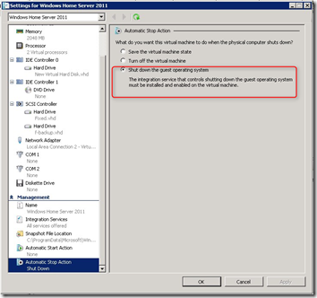
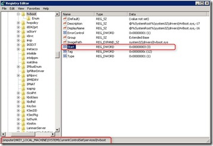
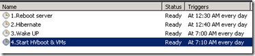

For my MS Hyper-V home server I want to hibernate every day between 12.30 and 07.00 am. When the Hyper-V role is installed, it is not possible to use the hibernate function. The following steps make it possible to automatic hibernate the system and when it wake up, the Hyper-V service and the VM(s) are started.

Steps:

**1.** Download “PowerShell Management Library for Hyper-V” file found [here](http://pshyperv.codeplex.com/). Unblock the zone information from this zip, extract it and run the install file. Copy the content in the “HyperV\_install” folder to

```
“%windir%\System32\WindowsPowerShell\v1.0\Modules\HyperV”
```

**2.** Edit VM properties of all VMs. Set the Automatic stop action “Shut down the guest operating system”

[]

**3.** Edit the registy to disable auto start the **hvboot** service. When installing the hyper-v role the hibernate and sleep functionality is disabled.  There is no way to use the hiberate or sleep functionality while the Hyper-v service is running.  The Start property of a service can have the following values:
```
0=Boot  
1=System (default)  
2=Auto  
**3=Demand**  
4=Disabled
```
Set the value to 3, so that you can start the service when you want. 0 is not supported for hvboot. Information found [here](http://blogs.msdn.com/b/tejas/archive/2009/03/10/hibernate-and-sleep-with-hyper-v-role-enabled.aspx).

[]

Reboot the server so that the hvboot service is not started.

**4.** Create 4 schedule tasks to run every day.

| Name | Time | Action |
| --- | --- | --- |
| 1.Reboot Server | 12.30 am | shutdown /r t 30 |
| 2.Hibernate | 12.40 am | shutdown /h |
| 3.Wake Up | 07.00 am | Under conditions select “Wake the computer to run this task” |
| 4.Start HVboot & VMs | 07.10 am | powershell.exe -command "c:\powershell\startvm.ps1" |

[](images/image7.png) 

The **startvm.ps1** script contains the following PowerShell syntax:

```
import-module hyperv
start-service hvboot
start-vm -vm "Windows Home Server 2011"
```

Test if the schedule tasks are running fine by manually execute them and you’re ready to hibernate.