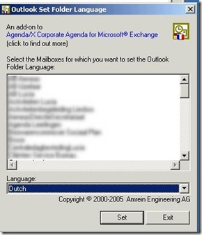

During a Microsoft Exchange (Exchange 2007 to Exchange 2007) migration between to organizations, I discovered that some mailboxes had an English folder structure in MS Outlook instead of a Dutch. After the mailbox is exported and imported using the export- and import-mailbox command, the users starts the Microsoft Outlook 2007 (Dutch). Microsoft Outlook 2007 creates the default leading Outlook folder structure in Dutch language such as “Postvak In”and “Agenda”. When the imported PST file contains an English Microsoft Outlook folder structure is also exist in the mailbox, but are not the leading default folders. So the mailbox contains folders as “Inbox” and “Postvak In”. For example the “Inbox” contains all the mail and the “Postvak IN” folder is empty and the default leading folder in Outlook. This can be very confusing and give problems such as syncing the mobile device.

There is a Outlook command line switch that resets default folder names (such as Inbox or Sent Items ) to default names in the current Office user interface language.  The syntax is:

**outlook.exe /resetfoldernames**

The Outlook command line switch /resetfoldernames didn’t work in this situation. To solve this problem I did a inventory on all the mailboxes who had an folder named “Inbox”  at the Exchange 2007 organization where to migrate **from** by executing the  the following PowerShell script in EMS:

```powershell
Get-Mailbox -ResultSize Unlimited | 
Get-MailboxFolderStatistics | where {$_.name -eq "Inbox"} | 
Select identity, folderpath | export-csv c:\temp\inbox.csv -NoTypeInformation
```
The output with all the mailboxes containing a “inbox” Outlook folder is written to the inbox.csv file.

The company Amrein Engineering has an cool utility called [Outlook set folder language.](http://www.amrein.com/download/OLFoLang.zip) With this utility you can rename **multiple** Mailbox Outlook folder(s) to another language such as: German, French, English, Italian, Spanish, Dutch, Danish, and Swedish.

For all the mailboxes I created a custom attribute and added them to the custom address list  by filtering on the  the custom attribute.  In the Outlook set folder language utility I selected the custom address list, selected all the mailboxes,  choose as language “Dutch” and hit the Set button. 

[](images/2011-03-03-14h04_48.jpg)

Within a short period all the mailbox folders were reset to the Dutch language at the Exchange organization were to migrate from. Now I could export and import all the mailboxes to the other Exchange Organization knowing that that every mailbox has the right Outlook folders language structure.

I want to thank everybody who helped me with this nasty problem.