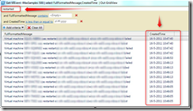

When VMware High Availability(HA) comes in action, the VMs are restarted (depending on the HA settings) on other VMware ESX servers in the cluster. It’s handy to know what VMs are restarted.

In the vCenter client the Tasks and Events page size can be increased. Default the vCenter client displays 100 tasks and events. In a cluster with a lot of host and a HA action the 100 tasks and events can be to low. So increasing the size will display the events that list what VMs ate restarted. Increasing can be done by using the following steps:
- Open the vCenter client
- Choose **Edit**
- **Client Settings**
- **Lists**
- Task and Events, Page size
- Increase the value (default value 100)

To find the VMs that are restarted click on the cluster, go to events tab and search for the following message:

**Virtual machine <VM> was restarted on <host> since <hostname> failed**

This is a time consuming task to filter out these messages. 

An easier and quicker way is to use PowerCLI and use the following one-liner:

```powershell
Get-VIEvent -MaxSamples 500 | select FullFormattedMessage,CreatedTime | Out-GridView
```

This one-liner displays the last 500 events in a gridview. Filter on the keyword “**restarted**” and all the VMs that are restarted are filtered in the gridview.

[](images/image1.png)