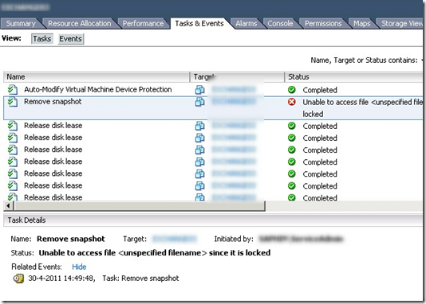
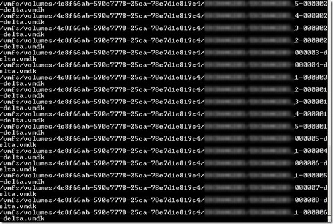
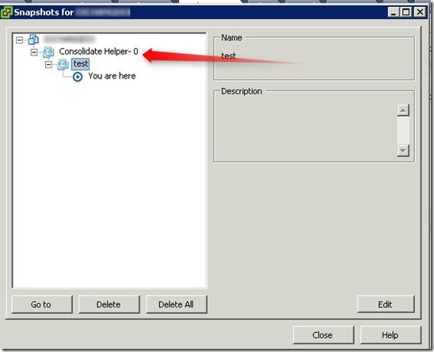

hen doing a health check I found the following error during the remove if a snapshot in vCenter:

> **Unable to access file <unspecified filename> since it is locked**

[](images/image.png)

There is a problem when committing the snapshot after the vStorage APIs for Data Protection (VADP) backup of the VM.

In the snapshot manager in vCenter there was no snapshot visible. I needed the be sure that no snapshot is active in the background.  This can be very dangerous when snapshots still active and grows. The snapshot can allocate al the free disk space on the datastore and slow down the VM.

By enabling remote Tech Support Mode (TSM)  on the VMware ESXi server I needed the be sure that no snapshot is active by using the following command:

```
find /vmfs/volumes/ -iname "\*delta.vmdk"
```

[](images/2011-05-02-15h16_20.jpg)

The command displays all the “delta.vmdk” snapshot files on all the VMFS volumes.  This command show that the snapshot is still active.

To “temporally” solve this problem:

Create a manual snapshot of the VM. When the snapshot is created the old “Consolidate Helper-0” is added to the snapshot manager.

[](images/2011-05-02-15h13_39.jpg)

Hit the Delete All Button and the two snapshots are committed. When the remove snapshot task is completed (this can take a while depending on the size of the snapshot). Run the find command again and verify if the snapshot is committed.

I see this problem lately with more customers who using VMware vSphere 4.1 Update 1 with different backup solutions such ad Symantec CommVault and Veeam that use VADP.  Let’s create a support incident.