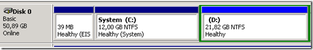
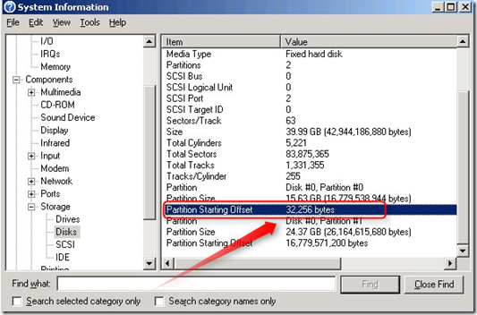
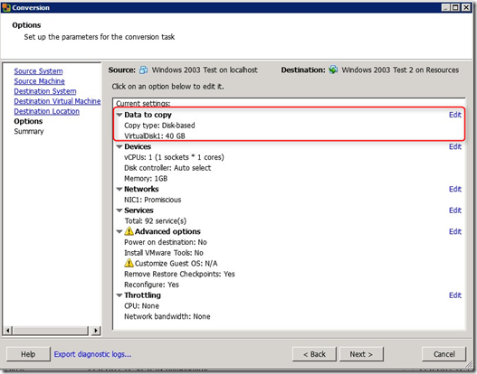
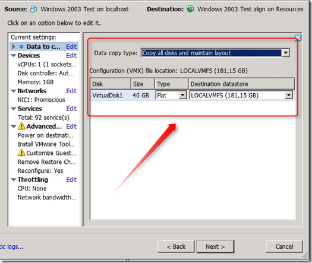
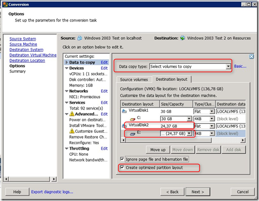
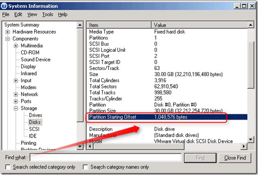

By using VMware Converter 5 the following disk optimizations can be easily done on your existing VM:

- Convert one or more partition(s) on single disk to partitions on a separate disks. When you want to increase disk space on the C: partition this is a problem because of the D partition is on the same disk.

- Resize one or more partition(s)
- Align on or more disks. (not needed anymore for Microsoft Windows 2008, Windows Vista  or greater). This example shows a partition that is not aligned

- Adjust the cluster size

**V2V procedure:**

- Power down the VM
- In VMware Converter select “Convert Machine”
- Follow the instructions on the screen till you got the options screen
- Edit the “**Data to copy**”

- Change the “Data copy type” from “**Copy all disks and maintain layout**” in

“**Select volumes to copy**”.

- Select “Advanced” and choose the “Destination” layout
- Change the disk size (in the example we change the C-partition to 30GB)
- Use “**Add Disk”**, the **VirtualDisk2** is created.
- Move the partition down (in the example the E: partition)
- Be sure that the “Create optimized partition layout” option is selected for all the disks.  VMware Converter optimize the disk partitions alignment”
- The cluster size in this example at the default value

- After the V2V the VM has 2 disks, the partition size is increased and both disk are aligned.

Check the disk alignment by using msinfo32.exe

VMware Converter 5.0 is available as public beta and can be found here.