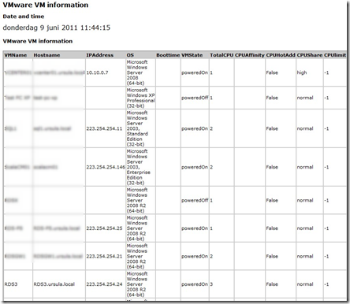
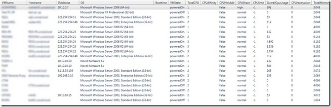

This PowerCLI script will display specified VM settings for all VMs in the vCenter server you specify. If you do an inventory, a health check or need to troubleshoot VMware environment this PowerCLI script can be useful.

The following VM settings will be displayed:
> VMName, Hostname, IP address, OS version, Boottime, VMstate, Total vCPUs, CPU afinnity, CPU hot add status, CPU share, CPU limit, Overall CPU usage, CPU reservation, Total memory, Memory share, Memory usage, Memory hot add status, Memory limit, Memory reservation, Memory swap, Memory ballooning, Memory compression, Total NICs, VMware tools status, VMware Tools version, VM hardware version, Timesync status and CBT status.

The output can be specified in the scripts. The following formats:
- CSV
- HTML

[](images/image.png)

- GridView. The cool about gridview is that you can easily sort and filter columns.

[](images/2011-06-09-11h44_42.jpg)

- On screen
- HTML file can be send by email.

**Requirements:**
- Microsoft PowerShell v2.0
- VMware PowerCLI 4.1 U1 build 332441

**What do I need to change:**

The following variables can be changed to suit your needs:

```powershell
# Variable to change
$CreateCSV= "yes"
$GridView = "yes"
$HTML = "yes"
$DisplayHTMLOnScreen = "yes"
$EmailHTML = "yes"
$SendEmail = "yes"
$EmailFrom = "vm@ivobeerens.nl"
$EmailTo = "info@ivobeerens.nl"
$EmailSubject = "VMs settings information"
$EmailSMTP = "smtpserver"
$FileHTML = New-Item -type file "D:\temp\VMInfo_$datefile.html"
$FileCSV = New-Item -type file "D:\temo\VMInfo_$datefile.csv"
```

**The PowerCLI script listing**:

```powershell
<#
.SYNOPSIS
Displays VM settings
.DESCRIPTION
Display VM settings by CSV, HTML, GridView, screen and as HTML by email
 
.Author(s)
Ivo Beerens www.ivobeerens.nl

.EXAMPLE
PS C:\> ./vminfo.ps1

#>

#Initialize PowerCLI
Add-PSSnapin VMware.VimAutomation.Core
C:\"Program Files (x86)\VMware\Infrastructure\vSphere PowerCLI\Scripts\Initialize-PowerCLIEnvironment.ps1" 

#Connect to vCenter
$VCServer = Read-Host "Enter the vCenter server name"
$Username= Read-Host "Enter the username"
$Password = Read-Host "Enter password"
Connect-VIServer $VCServer -User $username -Password $password -port 443

#Variables
$Date = get-date
$Datefile = ( get-date ).ToString(‘yyyy-MM-dd-hhmmss’)
$ErrorActionPreference = "SilentlyContinue"
# Variable to change
$CreateCSV= "yes"
$GridView = "yes"
$HTML = "yes"
$DisplayHTMLOnScreen = "yes"
$EmailHTML = "yes"
$SendEmail = "yes"
$EmailFrom = "vm@ivobeerens.nl"
$EmailTo = "info@ivobeerens.nl"
$EmailSubject = "VMs settings information"
$EmailSMTP = "smtpserver"
$FileHTML = New-Item -type file "D:\temp\VMInfo_$datefile.html"
$FileCSV = New-Item -type file "D:\temo\VMInfo_$datefile.csv"

#Add Text to the HTML file
Function Create-HTMLTable
{
param([array]$Array)
$arrHTML = $Array | ConvertTo-Html
$arrHTML[-1] = $arrHTML[-1].ToString().Replace(‘</body></html>’,"")
Return $arrHTML[5..2000]
}

$output = @()
$output += ‘<html><head></head><body>’
$output += 
‘<style>table{border-style:solid;border-width:1px;font-size:8pt;background-color:#ccc;width:100%;}th{text-align:left;}td{background-color:#fff;width:20%;border-style:so
lid;border-width:1px;}body{font-family:verdana;font-size:12pt;}h1{font-size:12pt;}h2{font-size:10pt;}</style>’
$output += ‘<H1>VMware VM information</H1>’
$output += ‘<H2>Date and time</H2>’,$date

#Gathering VM settings
Write-Host "Gathering VM statistics"
$Report = @()
Get-VM | Sort Name -Descending | %

 {
 
  $vm = Get-View $_.ID
    $vms = "" | Select-Object VMName, Hostname, IPAddress, OS, Boottime, VMState, TotalCPU, CPUAffinity, CPUHotAdd, CPUShare, CPUlimit, OverallCpuUsage, CPUreservation, TotalMemory, MemoryShare, MemoryUsage, MemoryHotAdd, MemoryLimit, MemoryReservation, Swapped, Ballooned, Compressed, TotalNics, ToolsStatus, ToolsVersion, HardwareVersion, TimeSync, CBT
    $vms.VMName = $vm.Name
    $vms.Hostname = $vm.guest.hostname
$vms.IPAddress = $vm.guest.ipAddress
$vms.OS = $vm.Config.GuestFullName
$vms.Boottime = $vm.Runtime.BootTime
$vms.VMState = $vm.summary.runtime.powerState
    $vms.TotalCPU = $vm.summary.config.numcpu
    $vms.CPUAffinity = $vm.Config.CpuAffinity
$vms.CPUHotAdd = $vm.Config.CpuHotAddEnabled
$vms.CPUShare = $vm.Config.CpuAllocation.Shares.Level
$vms.TotalMemory = $vm.summary.config.memorysizemb
    $vms.MemoryHotAdd = $vm.Config.MemoryHotAddEnabled
$vms.MemoryShare = $vm.Config.MemoryAllocation.Shares.Level
$vms.TotalNics = $vm.summary.config.numEthernetCards
$vms.OverallCpuUsage = $vm.summary.quickStats.OverallCpuUsage
    $vms.MemoryUsage = $vm.summary.quickStats.guestMemoryUsage
    $vms.ToolsStatus = $vm.guest.toolsstatus
    $vms.ToolsVersion = $vm.config.tools.toolsversion
$vms.TimeSync = $vm.Config.Tools.SyncTimeWithHost
$vms.HardwareVersion = $vm.config.Version
    $vms.MemoryLimit = $vm.resourceconfig.memoryallocation.limit
    $vms.MemoryReservation = $vm.resourceconfig.memoryallocation.reservation
    $vms.CPUreservation = $vm.resourceconfig.cpuallocation.reservation
    $vms.CPUlimit = $vm.resourceconfig.cpuallocation.limit
$vms.CBT = $vm.Config.ChangeTrackingEnabled
$vms.Swapped = $vm.Summary.QuickStats.SwappedMemory
$vms.Ballooned = $vm.Summary.QuickStats.BalloonedMemory
$vms.Compressed = $vm.Summary.QuickStats.CompressedMemory
$Report += $vms
}

#Output
if ($GridView -eq "yes") {
$report | Out-GridView }

if ($CreateCSV -eq "yes") {
$report | Export-Csv $FileCSV -NoTypeInformation }

if ($HTML -eq "yes") {
$output += ‘<p>’
$output += ‘<H2>VMware VM information</H2>’
$output += ‘<p>’
$output += Create-HTMLTable $report
$output += ‘</p>’
$output += ‘</body></html>’
$output | Out-File $FileHTML }

if ($DisplayHTMLOnScreen -eq "yes") {
ii $FileHTML}

if ($SendEmail -eq "yes") {
Send-MailMessage –From $EmailFrom –To $EmailTo –Subject $EmailSubject –SmtpServer $EmailSMTP -Attachments $FileHTML }

#Disconnect session from VC
Disconnect-VIserver -Confirm:$false
```
