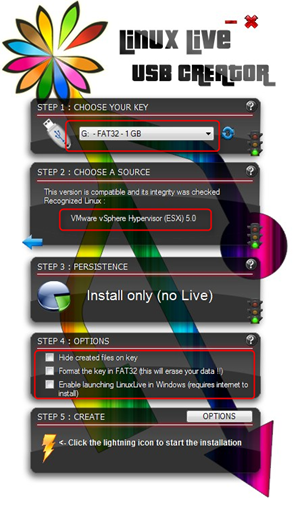

Here is a simple procedure to make a bootable VMware ESXi 5 or ESXi 6 USB stick in Windows and perform a scripted unattended VMware ESXi installation. The 5 steps are:

#### Step 1

Be sure removing all partitions and format a FAT32 partition on the USB stick by using the following command:

Open the command prompt and enter the following commands:
```
diskpart (make sure you run diskpart as administrator) 
list disk (list the disk in your system including the USB) 
select disk USB number 
clean 
create partition primary 
active 
format fs=fat32 quick
assign
exit
```

#### Step 2

Download the Windows LinuxLive USB creator utility [here](http://www.linuxliveusb.com/).

#### Step 3

Start the Lili USB creator utility.

 []

Follow the steps 1,2,4 and click 5 to create the USB stick. Wait till the USB creation process is finished. So now you have a bootable ESXi stick. You can stop here if you you want to install ESXi with manual installation steps. 

#### Step 4

Edit the BOOT.CFG file in the root of the USB stick and add **ks=usb** between /b.b00 and --- /useropts.gz modules

The BOOT.CFG should look like this:
```
bootstate=0 
title=Loading ESXi installer 
kernel=/tboot.b00 
kernelopt=runweasel 
modules=/b.b00 ks=usb --- /useropts.gz --- /k.b00 --- /a.b00 --- /ata-pata.v00 --- /ata-pata.v01 --- /ata-pata.v02 --- /ata-pata.v03 --- /ata-pata.v04 --- /ata-pata.v05 --- /ata-pata.v06 --- /ata-pata.v07 --- /block-cc.v00 --- /ehci-ehc.v00 --- /s.v00 --- /weaselin.i00 --- /ima-qla4.v00 --- /ipmi-ipm.v00 --- /ipmi-ipm.v01 --- /ipmi-ipm.v02 --- /misc-cni.v00 --- /misc-dri.v00 --- /net-be2n.v00 --- /net-bnx2.v00 --- /net-bnx2.v01 --- /net-cnic.v00 --- /net-e100.v00 --- /net-e100.v01 --- /net-enic.v00 --- /net-forc.v00 --- /net-igb.v00 --- /net-ixgb.v00 --- /net-nx-n.v00 --- /net-r816.v00 --- /net-r816.v01 --- /net-s2io.v00 --- /net-sky2.v00 --- /net-tg3.v00 --- /ohci-usb.v00 --- /sata-ahc.v00 --- /sata-ata.v00 --- /sata-sat.v00 --- /sata-sat.v01 --- /sata-sat.v02 --- /sata-sat.v03 --- /scsi-aac.v00 --- /scsi-adp.v00 --- /scsi-aic.v00 --- /scsi-bnx.v00 --- /scsi-fni.v00 --- /scsi-hps.v00 --- /scsi-ips.v00 --- /scsi-lpf.v00 --- /scsi-meg.v00 --- /scsi-meg.v01 --- /scsi-meg.v02 --- /scsi-mpt.v00 --- /scsi-mpt.v01 --- /scsi-mpt.v02 --- /scsi-qla.v00 --- /scsi-qla.v01 --- /uhci-usb.v00 --- /tools.t00 --- /imgdb.tgz --- /imgpayld.tgz 
build= 
updated=0
```
 

#### Step 5

Create a Kickstart configuration file for the scripted installation in the root of the USB stick. Here is an example:
```
#Sample kickstart scripted installation
vmaccepteula
rootpw VMw@re
install --firstdisk --overwritevmfs
network --bootproto=static --ip=192.168.250.21 --gateway=192.168.250.1 --nameserver=192.168.250.6 --netmask=255.255.255.0 --hostname=esxi5-01.beerens.local --device=vmnic0 --addvmportgroup=0
reboot

%firstboot --interpreter=busybox
# Rename local datastore name
vim-cmd hostsvc/datastore/rename datastore1 "$(hostname -s)-local-storage-1"
# DNS names
esxcli system hostname set --fqdn=esxi5-01.beerens.local
esxcli network ip dns search add --domain=beerens.local
# DNS server addresses
esxcli network ip dns server add --server=192.168.250.6
esxcli network ip dns server add --server=192.168.250.1
# SSH and ESXi shell
vim-cmd hostsvc/enable\_ssh
vim-cmd hostsvc/start\_ssh
vim-cmd hostsvc/enable\_esx\_shell
vim-cmd hostsvc/start\_esx\_shell
```

For editing and creating the boot.cfg and ks.cfg file in Windows I use [Notepad++](http://notepad-plus-plus.org/) so NO hidden carriage returns are in the files. And the USB stick creation in ready.

An easy way to test the ESXi 5 USB stick and the scripted installation  is using VMware Workstation. See my post “Boot from USB in VMware Workstation” found [here](https://www.ivobeerens.nl/2009/10/16/boot-from-usb-in-VMware-workstation/).