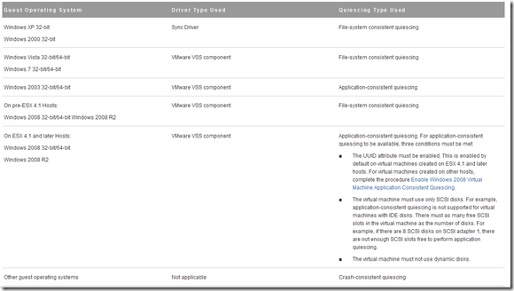

VMware Data Recovery (vDR) is an appliance to backup, storage, and recovery of virtual machines and files within the virtual environment. The new version 2.0 has the following enhancements:
- VMware Data Recovery 2.0 is now a fully 64-bit virtual appliance.
- Email reports. VMware Data Recovery 2.0 makes it possible to generate and email reports, in a fully automated fashion, to an administrator following the completion of a backup.
- Better deduplication Performance
- Job Suspension. VMware Data Recovery enables users to suspend individual jobs from continuing to run by right-clicking on the backup job and selecting “Suspend Future Tasks.”
- Advanced Options such as Change the number of days between automated integrity checks, Specify the day of the week on which the automated integrity check is run and Exclude or include backup of swap partitions or page data.
- Windows pagefile and Linux swap partitions are automatically excluded from backup by default.
- If the maintenance window closes before an integrity check or reclaim operation is completed, the datastore is not locked as it was in prior releases. This enables backups to continue working even if maintenance is not completed. If, however, damaged restore points are detected, the deduplication datastore will be locked until the damaged restore points are deleted.
- Issues resolved found in vDR 1.2.1:
- CIFS target handling and resilience • Incremental RDM backup • Backups failing with “not enough disk space” errors • Backups failing with “disk full” error despite free space being available

### Before implementing vDR 2.0 consider the following things:

- VMware Data Recovery is available in the following vSphere 5 editions: Essentials plus, Standard, Enterprise and Enterprise Plus.
- It is possible to full disaster recovery even when there isn’t any vCenter server available for example because it was installed as VM. Follow these steps:
- Connect directly to a ESXi server with the vSphere client 
- Install the VMware Data Recovery appliance
- Install the VMware Data Recovery client
- Connect to the VMDK, NFS or CIFS share used as deduplication store(s)
- Message appears to import the “old” configuration:

> []

- Select “yes” to import the “old” configuration
- Now the configuration is back, you are ready to restore all the VMs
- Each backup appliance can protect a total of 100 Virtual Machines. If you want more VMs to backup add an extra backup appliance.
- Each instance of vCenter Server can support up to ten Data Recovery backup appliances.
- support deduplication stores that are up to one terabyte in size and each backup appliance is limited to using two deduplication stores per appliance ( 1 TB on VMDKs and RDMs and 500 GB on CIFS network shares).
- vDR requires an absolute minimum of 10 GB of free space per store for indexing and restore point processing. Due to this seize the stores not smaller as 50 GB.
- For initial setup seize the deduplication store space equal to the amount of used disk space on all the VMs being protected.
- Use VMDK’s as deduplication store use thick provisioning eager zeroed for the best performance.
- Place the deduplication store(s) on storage device on another location.
- Using CIFS shares as deduplication store avoid stores on servers with multiple roles or/and services and in a VM.
- CIFS shares with passwords limited to 64 characters or less. CIFS share passwords must conform to the Latin 1(ISO 8859-1) standard. Double-byte characters are not supported.
- NFS is only supported as a deduplication store format if the share is presented by an ESX/ESXi Server and the VMDK is assigned to the Data Recovery appliance.
- All the vDR appliances are managed separately.
- Hardware version 7 of higher is needed for using Changed Block Tracing (CBT). Upgrade the hardware version 4 VMs.
- Windows pagefiles (pagefile.sys) file and the Linux swap partition is not backed up.
- VMware Data Recovery uses Microsoft Windows Volume Shadow Copy Service (VSS) quiescing ( point-in-time copies).
- Here’s an overview of the Guest Operating Systems and the quiescing method:

[]

- Application consistent quiescing of Windows 2008 virtual machines is only available when those virtual machines are created in vSphere 4.1 and later. Virtual machines created in vSphere 4.0 can be updated to enable application consistent quiescing, as described in Enable Windows 2008 Virtual Machine Application Consistent Quiescing.
- Because Data Recovery uses VSS, Data Recovery can create snapshots while ensuring application consistency. This means that applications write to disk any important data that is currently in memory, making sure that a later restore of that virtual machine can restore the application back into a consistent state.
-  A maximum of 8 virtual machines can be backed up simultaneously. Default only 14 SCSI disks can be hot-added. For example when backup 8 VMs with three disks, the hot-add can only hot-add 14 disks, the other disks are backed up over the network. Add an extra dummy disk (1MB) for every SCSI adapter in the vDR appliance configuration so that the hot-add has enough room.

vDR does not support:
- Backing up virtual machines that are protected by VMware Fault Tolerance
- Backing up virtual machines with 3rd party multi-pathing enabled where shared SCSI buses are in use
- Raw device mapped (RDM) disks in physical compatibility mode in virtual machines to be backed up
- Multiple backup appliances on a single host
- Backup of virtual machine disks that are marked as Independent
- Backup of Storage Virtual Appliances (SVAs)

**-** vDR is intent for SMB customer. When using more than one vDR appliance it’s difficult to manage. If you want more robust  solution look 3e party software for example at Veeam Backup and Recovery.