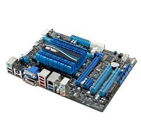
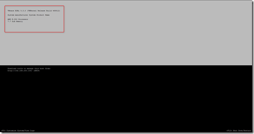
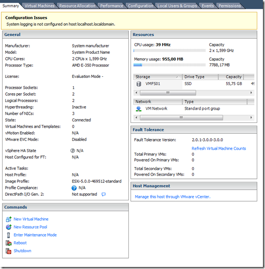
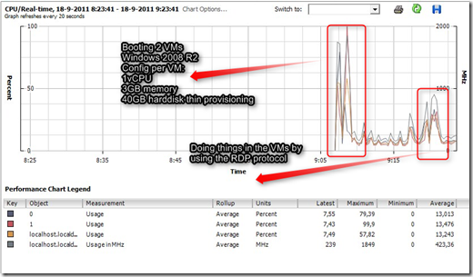
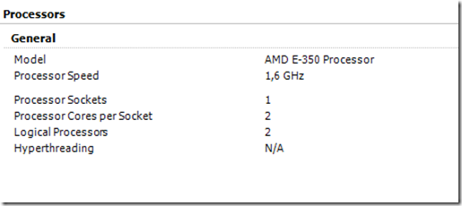
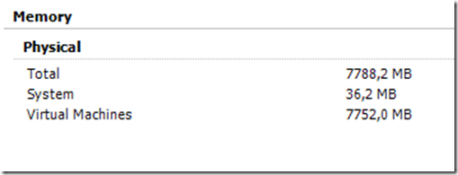
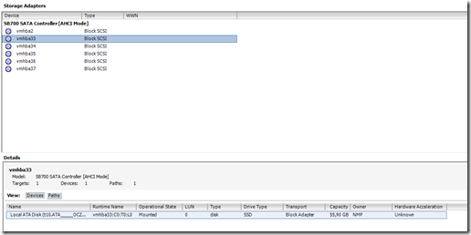

If you want a low power consumption whitebox motherboard to run some VMs that are not resource intensive the Asus E35M1-M PRO Zacate motherboard is an option. It has an AMD E-350 dual core 1,6 GHz processor with passive cooling, onboard graphics, max 8GB memory support, onboard LAN and 5x SATA 6 onboard. And it’s cheap.

I test the Asus E35M1-M PRO Zacate motherboard in my home lab, and it will run for VMware ESXi 5.0.0 build 469512. This motherboard can be used in a homebrew server.

**Specifications Asus E35M1-M PRO Zacate motherboard:**

|  | |
| --- | --- |
| Form factor	| uATX |
| CPU	| AMD Fusion E-350 Dual-core onboard processor with passive cooler |
| Memory	| Corsair XMS3 DDR3,1333-8GB KIT (2x4GB)
| Graphics	| Onboard integrated ATI Radeon HD 6310 GPU
| Storage	| 5 x SATA 6 Gb/s
| LAN	| 1 x Realtek 8111E , 1 x Gigabit LAN Controller
| USB ports	| 2 x USB ports, 12 x USB 2. ports
| BIOS | 32 Mb flash ROM UEFI
|  | |

Here are some screenshots from the vSphere Client:

**VMware ESXi 5.0.0 DCUI**

**Summary page**

**Example of the processor load with 2 x MS Windows 2008 R2 VMs**

**Onboard processor**

**Memory**

**Onboard disk controllers**

**The Realtek onboard LAN adapter.**

In VMware ESX|(i) 4.x the Realtek LAN adapter is not supported.

**Power consumption**

The following configuration is used:

> - Asus E35M1-M Pro
> 
> - Corsair XMS3 DDR3,1333-8GB KIT (2 x 4GB memory)
> 
> - OCZ Vertex Plus - 60GB - 2.5inch
> 
> - Be Quiet! Pure Power L7 300W
> 
> - Hypervisor VMware ESXi 5

Here are some test I did:

> - Startup VMware ESXi 5 30 Watt
> 
> - Idle with two Microsoft Windows 2008 R2 VMs 25 Watt
> 
> - One Microsoft Windows 2008 R2 VM with 100% (using the cpubusy.vbs script) processor load 28 Watt
> 
> - Two Microsoft Windows 2008 R2 VM with 100% (using the cpubusy.vbs script) processor load between 30 and 32 Watt

To power consumption is not bad if you want to run a couple of VMs 24x7.