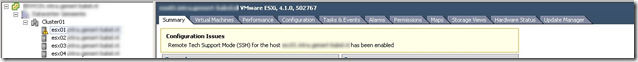

When you start the Remote Tech Support (TSM) service on a VMware ESXi host a warning and the following message will appear:

> Remote Tech Support Mode (SSH) for the host … has been enabled

[]

When the warning appears some Admins get a little nervous. Since VMware ESXi 4.1 Update 2 and VMware ESXi 5 the warning can be suppressed.

When starting the Remote Tech Support (TSM) service it is possible to SSH to the ESXi host.

The following script can start or stop the Remote Tech Support mode and suppress the warnings on the VMware ESXi hosts.

```powershell
<#
.SYNOPSIS
  Enable or Disable TSM 
.VERSION
 1.0
.DESCRIPTION
  TSM-SSH Remote Tech Support (SSH) 
.NOTES
  Author(s): Ivo Beerens 
.EXAMPLE
  PS> ./tsm.ps1
#>

Add-PSSnapin VMware.VimAutomation.core -ErrorAction SilentlyContinue

# VMware VirtualCenter server name 
$VCserver = read-host "Enter your vCenter server"
$Username= read-host "Enter the username"
$Password = read-host "Enter password"

# Connect to the vCenter server 
Connect-VIServer $VCserver -User $Username -Password $Password -port 443
 
# Menu
Write-Host "Choose Start or to stop the Remote Tech Support (SSH)service"
Write-Host " 1. Start Remote Tech Support (SSH)"
Write-Host " 2. Stop Remote Tech Support (SSH)"
$response = Read-Host "Select 1 or 2"

if ($response -eq 1){
#Start
get-vmhost | Set-VMHostAdvancedConfiguration -Name "UserVars.SuppressShellWarning" -Value 1
get-vmhost | Get-VMHostService | Where {$\_.key -eq "TSM-SSH"} | Start-VMHostService 
}

if ($response -eq 2){
#Stop
get-vmhost | Get-VMHostService | Where {$\_.key -eq "TSM-SSH"} | Stop-VMHostService -Confirm:$false
get-vmhost | Set-VMHostAdvancedConfiguration -Name "UserVars.SuppressShellWarning" -Value 0 
}
```
