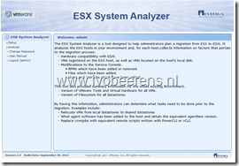
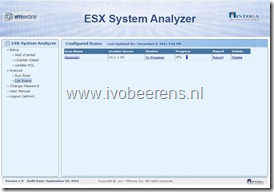
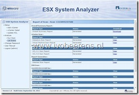
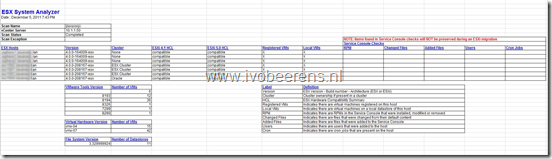
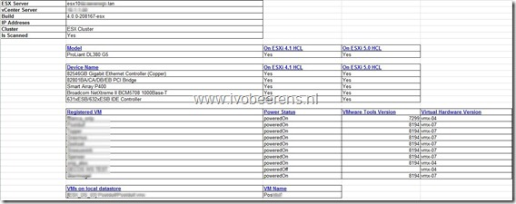

VMware Flings did it again. They released another cool tool called “ESX System Analyzer”. This tool helps when you want to migrate from VMware ESX to VMware ESXi. It scans the VMware environment and collects the following information:
- Hardware compatibility with ESXi. It checks if the hardware is compatible with ESXi 4 and ESXi 5.
- VMs registered on the ESX host, as well as VMs located on the host’s local disk
- Modifications to the Service Console  
        - RPMs which have been added or removed  
        - Files which have been added  
        - Users and cronjobs which have been added

This tool also provides summary information for the whole existing environment

- Version of VMware Tools and Virtual Hardware for all VMs
- Version of Filesystem for all datastores

By having this information, administrators can determine what tasks need to be done prior to the migration. Examples include:
- Relocate VMs from local datastores to shared datastores
- Make note of what agent software has been added to the host and obtain the equivalent agentless version
- Replace cronjobs with equivalent remote scripts written with PowerCLI or vCLI

The installation and configuration of the “ESX System Analyzer” appliance is very easy. Here are some screenshots of the appliance:

<table border="0" cellspacing="0" cellpadding="2" width="400"><tbody><tr><td valign="top" width="200"><a href="images/image.png"></a></td><td valign="top" width="200"><a href="https://www.ivobeerens.nl/wp-content/uploads/2011/12/2011-12-05-15h14_18.jpg"></a></td></tr><tr><td valign="top" width="200"><a href="https://www.ivobeerens.nl/wp-content/uploads/2011/12/2011-12-05-15h19_56.jpg"></a></td><td valign="top" width="200"></td></tr></tbody></table>

Screenshots of the Output in XLS (Excel):

**Overview output:**

[]

**ESX server output:**

This is a very handy tool when you want to migrate from VMware ESX to ESXi. More information can be found on the VMware Flings website found [here](https://labs.VMware.com/flings/esx-system-analyzer).