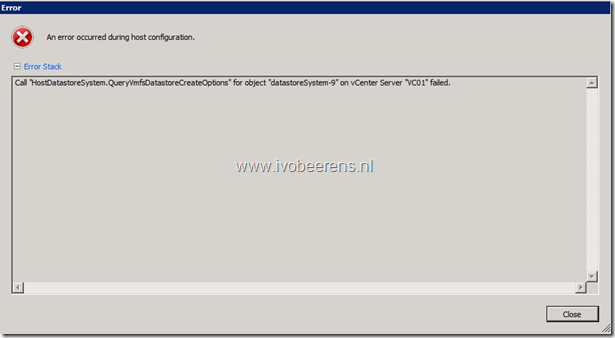
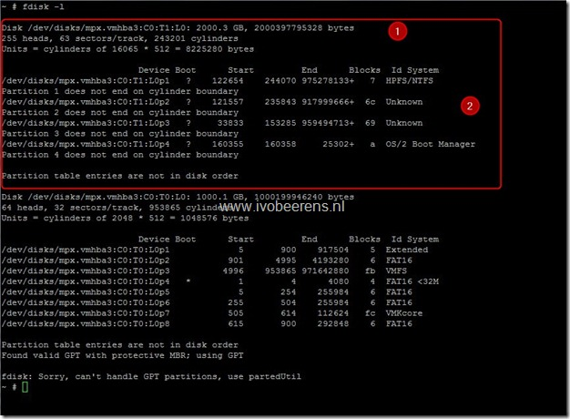
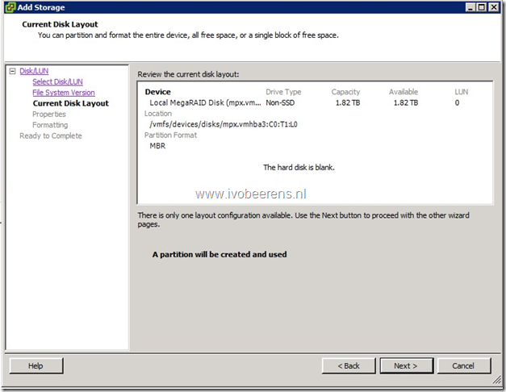

On my home lab I tried to create a new VMFS volume on a RAID-0 disk set that was coming from another host. When creating the new VMFS volume from the vSphere client, the following error appeared:

> Call “HostDatastoreSystem.QueryVmfsDatastoreCreateOptions” for object “datastoresystem-9” on vCenter Server “VC01″ failed.

On the VMware ESXi 5 server I enabled “Local Tech Support Mode”, so I was able to logging in directly on the console and used the **fdisk-l** command to see the partition information on the disk. I notice that the disk contains four old partitions from another system.

I deleted the four partitions by using the following commands (**displayed in bold**):

- **fdisk /dev/disk/mpx.vmhba3:C0:T1:LO** (see the above picture)
- **p** (for printing the partition information and verify that you choose the right disk)
- **d** and enter the partition numbers (**1**, **2**, **3**, and **4)** for deleting the partition
**- p** to verify that all the partitions are deleted
- **w** to write the modifications to disk

After the deletion of the old partitions I was able to create the VMFS volume on the RAID-0 disk set.

