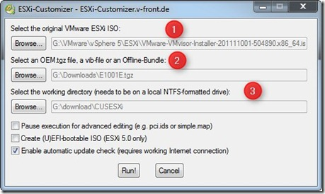

I tested the NICs below in my VMware ESXi 5.x whitebox server at home. Here the status:
<table border="0" width="400" cellspacing="0" cellpadding="2"><tbody><tr><td valign="top" width="133"><strong>NIC</strong></td><td valign="top" width="133"><strong>Recognized by VMware ESXi 5</strong></td><td valign="top" width="133"><strong>Listed in ESXi 5 as</strong></td></tr><tr><td valign="top" width="133">Intel PRO/1000GT Desktop Adapter PCI</td><td valign="top" width="133">Yes</td><td valign="top" width="133">Intel 82541PI Gigabit Ethernet Controller</td></tr><tr><td valign="top" width="133">Realtek RTL 8111E</td><td valign="top" width="133">Yes</td><td valign="top" width="133">Realtek 8168 Gigabit Ethernet</td></tr><tr><td valign="top" width="133">Intel Gigabit CT Desktop Adapter PCI-e</td><td valign="top" width="133">Yes</td><td valign="top" width="133">Intel Corporation 82574L</td></tr><tr><td valign="top" width="133">Intel 82579 Gigabit LAN controller</td><td valign="top" width="133"><strong>No </strong>You need the make a customized ESXi 5 ISO or VIB file.This is a not supported configuration!</td><td valign="top" width="133">Intel Corporation 82579V&nbsp;orIntel Corporation 82579LM</td></tr></tbody></table>

To add for example the Intel 82579 chipset, create a customized ESXi 5 ISO.  This is very simple because some people have already done the hard work.

Here are the steps:

1. Download ESXi-Customizer (create by Andreas Peetz)
2. Download the driver (created by Chilly)
3. Start the ESXi-Customizer and follow the 3 steps:

And you're ready to create the customized VMware ESXi 5 ISO. The ISO supports the Intel 82579V and 82579LM NIC(s) found on many whitebox motherboards today. Possible future updated version(s) of the driver can be found in the following [post](http://hardforum.com/showthread.php?t=1607992).