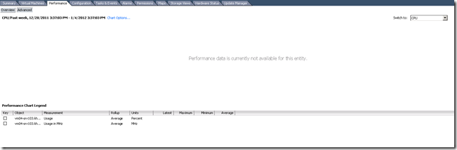
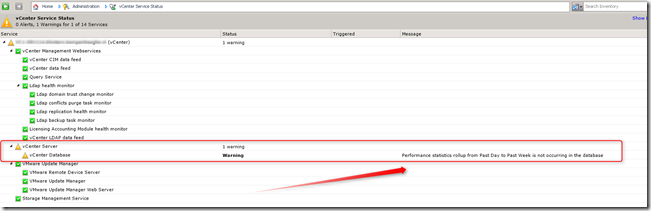
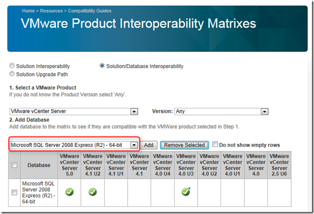

When looking for performance data in vCenter 4.1 from the past week, month or year, I got the message “Performance data is currently not available for this entry”. Only real time data is visible in vSphere client.

[]

In the vCenter Service Status the warning “Performance statistics rollup from Past Day to Past Week is not occurring in the database” appeared.

[]

The vCenter server is installed on MS Windows 2008 R2 and uses vCenter server version 4.1 Update 2 Build 491557 with Microsoft SQL Server 2008  Express R2 64-bit.

When looking in the VMware Product Interoperability matrixes, it says is a supported configuration.

[]

Searching on the [VMTN](http://communities.VMware.com/thread/308894?start=15&tstart=0) I found more people who are experiencing this problem. The following KB article says:

> To resolve this issue, migrate the SQL database to a full edition (32bit or 64bit) or a 32bit SQL Express edition. For more information on how to move the vCenter Server SQL database, see...........

For small environments this is not an option! When installing vCenter 4.1 Update 2, the MS SQL Express 2005 database is default installed. MS SQL Express 2005 is 32-bit application and you can have a maximum database size of 4GB. With MS SQL Server 2008 Express R2 64-bit you can have maximum database size of 10GB.

vCenter 5 installs by default MS SQL Server 2008 Express R2 64-bit and doesn’t have this bug.

The MS SQL Express database is only supported for test and small VMware environments (5 hosts and 50 VMs maximum).

So watch out when considering MS SQL Server 2008 Express R2 64-bit and vCenter 4!