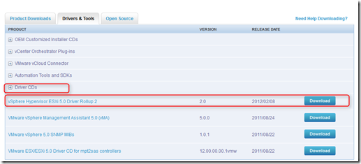
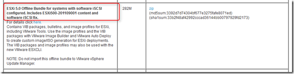
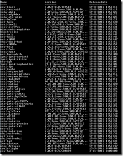
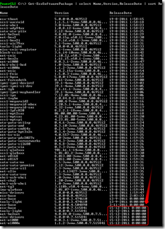
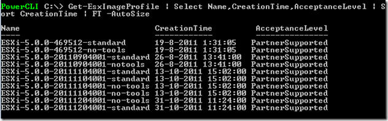
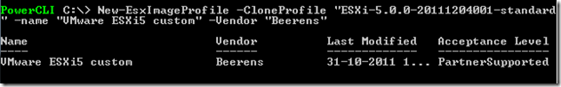
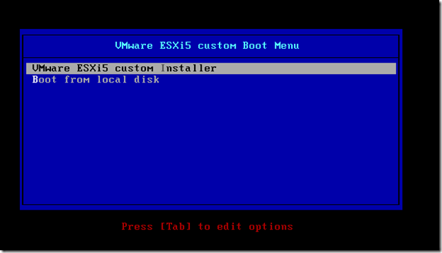
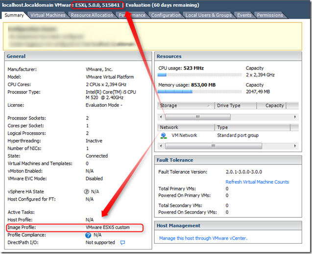

When you want to customize the VMware ESXi 5 installation media you need to use Image Builder. Image Builder CLI is a set of PowerCLI cmdlets that you can use to manage vSphere image profiles and VIB (VMware Installation Bundle) packages, such as driver VIBs and update VIBs. You can also use Image Builder cmdlets to export an image profile to an ISO or offline depot ZIP file that you can use to install ESXi with a customized set of updates, patches, and drivers

In this blog post are the steps outlined on how-to create a customized VMware ESXi5 ISO with the latest patches. Adding the latest patches can be useful because it contains for example the updated HP Emulex net-be2net driver needed for HP Flex-10 ESXi5 installations.

[](images/image13.png)

#### Prerequirements

1. Download and install PowerCLI 5.x. Open PowerCLI and set the remote signing to RemoteSigned by using the following command:

```
Set-ExecutionPolicy RemoteSigned
```

2. Create a folder structure like this:

> ```<drive letter>:\ImageBuil\ESXi```

3. Download the VMware ESXi Offline bundle from the VMware download website and save the file in ```<driveletter>:\ImageBuil\ESXi```

[](images/image4.png)

The ESXi offline bundle we use is named ```ESXi500-201111001.zip```

#### Create a customized ESXi5 ISO

1. Add the ESXi offline bundle and latest patches to depots*

Add the VMware ESXi offline bundle and the latest patches use the **Add-EsxSoftwareDepot** command.  First add the offline ESXi depot by using the following command:

```Add-EsxSoftwareDepot F:\ImageBuil\ESXi\ESXi500-201111001.zip```

Return a list of all the VMware Installation Bundle (VIB) objects, use the ```Get-EsxSoftwarePackage``` command. This example list all the software package (VIB) objects sorted on release pubDate:

```Get-EsxSoftwarePackage | select Name,Version,ReleaseDate | sort ReleaseDate```

Add the URL of the patch depot (we use the VMware Update Manager URL) using the following command:

```Add-EsxSoftwareDepot -DepotUrl https://hostupdate.VMware.com/software/VUM/PRODUCTION/main/vmw-depot-index.xml```

List the VMware Installation Bundle (VIB) objects again and see the new VIBs added:

```Get-EsxSoftwarePackage | select Name,Version,ReleaseDate | sort ReleaseDate```

<table border="0" width="400" cellspacing="0" cellpadding="2"><tbody><tr><td valign="top" width="200"><a href="images/image5.png"><span "></span></a></td><td valign="top" width="200"><a href="https://www.ivobeerens.nl/wp-content/uploads/2012/02/image7.png"><span "></span></a></td></tr><tr><td valign="top" width="200"><span  font-family: 'Courier New';"><strong>output using:</strong></span><div></div>Add-EsxSoftwareDepot F:\ImageBuil\ESXi\ESXi500-201111001.zip</td><td valign="top" width="200"><span style="font-family: 'Courier New';"><strong><span ">output using:</span></strong></span><div></div><span style="font-size: small;">Add-EsxSoftwareDepot -DepotUrl </span><a href="https://hostupdate.VMware.com/software/VUM/PRODUCTION/main/vmw-depot-index.xml"><span  font-family: 'Courier New'; font-size: small;"><strong>https://hostupdate.VMware.com/softw</strong></span></a> <a href="https://hostupdate.VMware.com/software/VUM/PRODUCTION/main/vmw-depot-index.xml"><span  font-family: 'Courier New'; font-size: small;"><strong>are/VUM/PRODUCTION/main/vmw-depot-index.xml</strong></span></a></td></tr></tbody></table>

**2.** **Clone the existing image profile**

Run the Get-EsxImageProfile cmdlet to find the name of the profile that you want to clone.

```Get-EsxImageProfile | Select Name,CreationTime,AcceptanceLevel | Sort CreationTime | FT -AutoSize```

[](images/image8.png)

Clone the latest image profile using this command:

```New-EsxImageProfile -CloneProfile "ESXi-5.0.0-20111204001-standard" -name "VMware ESXi5 custom" -Vendor "Beerens"```

[](images/image9.png)

**3\. Export the image profile to ISO**

Export an image profile to an ISO image or a ZIP file of component files and folders. The following command export the image profile to an ISO:

```Export-EsxImageProfile -ImageProfile "VMware ESXi5 custom" –ExportToIso -FilePath F:\\ImageBuil\\esxi5custom.iso```

And you are ready to boot from the new installation media named **esxi5custom.iso.** Check the following components to see if the customization has the desired result:
- VMware ESXi 5 Boot Menu
- VMware ESXi build
- Image Profile name

[](images/image11.png)

[](images/image12.png)