Today the Windows 8 Consumer Preview is launched. To install the Windows 8 Consumer Preview as VM in VMware vSphere 5, use the following steps:
1. Install VMware ESXi 5.0 patch release [ESXi500-201112001](http://kb.VMware.com/selfservice/microsites/search.do?cmd=displayKC&docType=kc&docTypeID=DT_KB_1_1&externalId=2007680). If you didn’t install the patch the following screen appears when booting the Windows 8 ISO:

[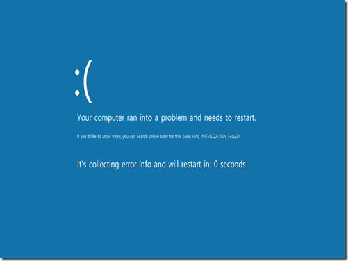]

> Your computer ran into a problem and needs to restart

2. When the patch is installed, create a new VM and choose the following settings:

<table border="0" cellspacing="0" cellpadding="2" width="400"><tbody><tr><td valign="top" width="200"><a href="images/image17.png">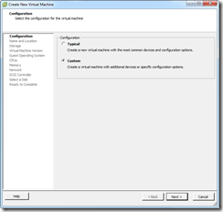</a></td><td valign="top" width="200"><a href="https://www.ivobeerens.nl/wp-content/uploads/2012/03/image4.png">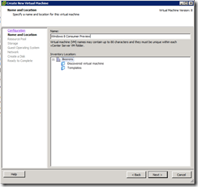</a></td></tr><tr><td valign="top" width="200">1. Choose custom</td><td valign="top" width="200">2. Enter VM Name</td></tr><tr><td valign="top" width="200"><a href="images/image19.png">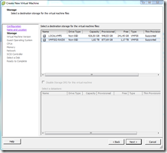</a></td><td valign="top" width="200"><a href="images/image20.png">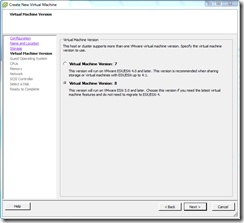</a></td></tr><tr><td valign="top" width="200">3. Select datastore</td><td valign="top" width="200">4. Virtual Machine Version 8</td></tr><tr><td valign="top" width="200"><a href="https://www.ivobeerens.nl/wp-content/uploads/2012/03/image5.png">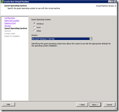</a></td><td valign="top" width="200"><a href="images/image22.png">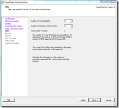</a></td></tr><tr><td valign="top" width="200">5. Choose Microsoft Windows 7 64-bit</td><td valign="top" width="200">6. Select the amount of processor and cores needed</td></tr><tr><td valign="top" width="200"><a href="https://www.ivobeerens.nl/wp-content/uploads/2012/03/image6.png">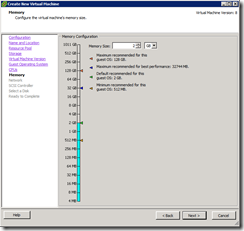</a></td><td valign="top" width="200"><a href="images/image24.png">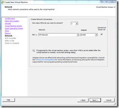</a></td></tr><tr><td valign="top" width="200">7. Enter memory</td><td valign="top" width="200">8. Select E1000 network adapter</td></tr><tr><td valign="top" width="200"><a href="images/image25.png">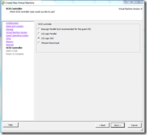</a></td><td valign="top" width="200"><a href="images/image26.png">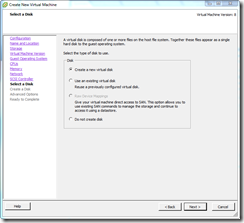</a></td></tr><tr><td valign="top" width="200">9. Select default SCSI controller</td><td valign="top" width="200">10. Create New disk</td></tr><tr><td valign="top" width="200"><a href="https://www.ivobeerens.nl/wp-content/uploads/2012/03/image7.png">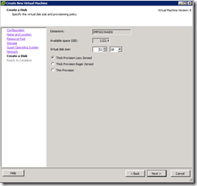</a></td><td valign="top" width="200"><a href="images/image28.png">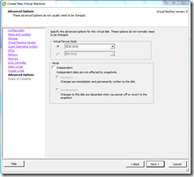</a></td></tr><tr><td valign="top" width="200">11. Enter the desired disk size (default)</td><td valign="top" width="200">12 Select controller</td></tr><tr><td valign="top" width="200"><a href="https://www.ivobeerens.nl/wp-content/uploads/2012/03/image8.png">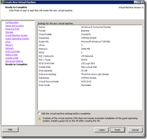</a></td><td valign="top" width="200"></td></tr><tr><td valign="top" width="200">13. Finish</td><td valign="top" width="200"></td></tr></tbody></table>

3. Edit the VM configuration and change the following settings:

<table border="0" cellspacing="0" cellpadding="2" width="400"><tbody><tr><td valign="top" width="200"><a href="images/image3.png">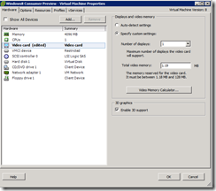</a></td><td valign="top" width="200"><a href="images/image31.png">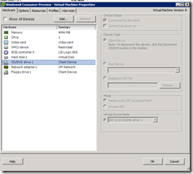</a></td></tr><tr><td valign="top" width="200">Enable 3D graphics</td><td valign="top" width="200">Choose the Windows 8 ISO to boot from</td></tr><tr><td valign="top" width="200"><a href="https://www.ivobeerens.nl/wp-content/uploads/2012/03/image9.png">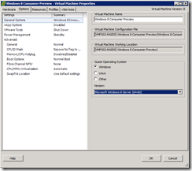</a></td><td valign="top" width="200">&nbsp;</td></tr><tr><td valign="top" width="200">Select as guest OS “Microsoft Windows 8 Server (64-bit)”</td><td valign="top" width="200"></td></tr></tbody></table>

4\. Boot the VM and install Windows 8

Now you’re able to install Windows 8 as VM in VMware vSphere 5.

[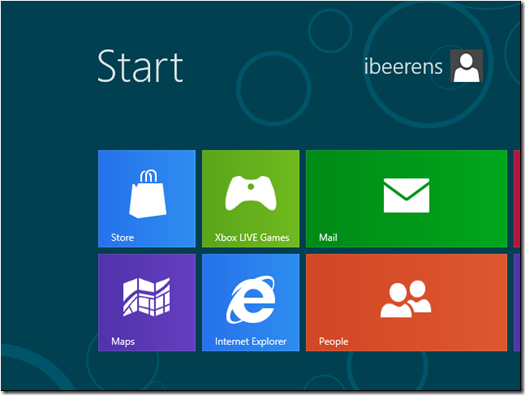]