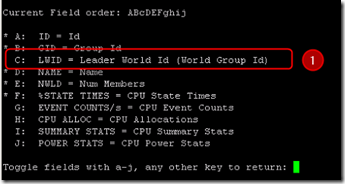

There are different ways to kill an unresponsable VM by using the vCLI or the console. In VMware ESXi, it is possible to kill a running VM process by using esxtop or resxtop. For VMware ESXi you need to enter Tech Support Mode (TSM) first to run esxtop.

The following procedure can be used to kill a VM (The bold text are the commands to enter):

**esxtop**
- Press **c** for the CPU resource screen
- Press **shift + V** to display VMs only
- Press **f** to change the display fields

- Press **c** to select the LWID (Leader World Id) and press **enter**
- Identify the VM by it’s LWID
- Press **k**
- Enter the **LWID** of the VM to kill and press enter
- Wait for 30 seconds and validate that the VM is no longer listed