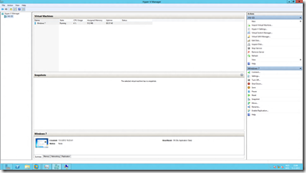
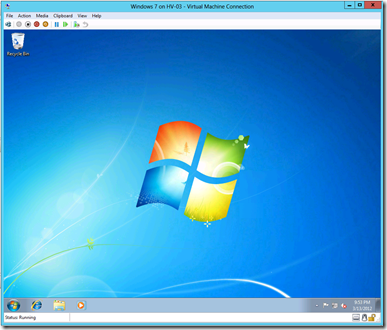
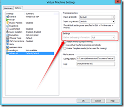

VMware Workstation Technology Preview 2012 is available as download. The Technology Preview makes it possible for example to install and operate Windows 8 and Windows Server 8 in a VM and the possibility to nest VMs.

I tested the installation of  Windows Server 8 in VMware Workstation TP, enabled the Hyper-V role and run a Windows 7 64-bit VM in Hyper-V. Here are some screenshots (Hyper-V manager and the Windows 7 64  bit running in Hyper-V): 

[]

[]

To make the above configuration work, add to following options to the end of the VMX file before starting the Windows Server 8 installation:

```
hypervisor.cpuid.v0 = FALSE
mce.enable = "TRUE"
```

The VMware Workstation TP VMs are started in debug mode which impacts the performance!  

[]