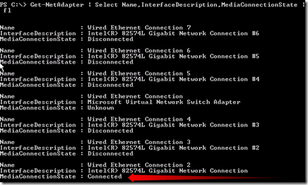
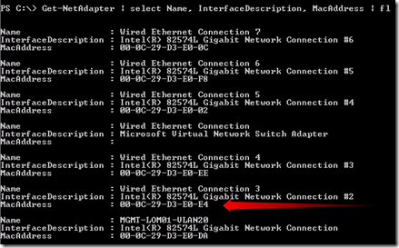
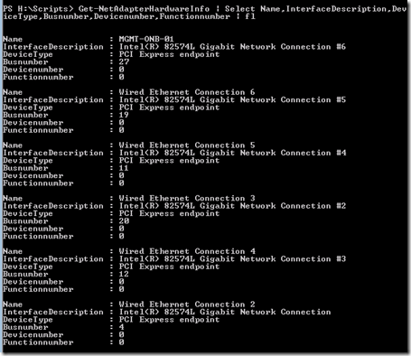

In a Hyper-V cluster are normally a lot of NICs involved. Identifying the right can be challenging. It is important to consequently label your network adapters on all the servers in the Hyper-V cluster.

In Windows Server 2012 there are PowerShell Cmdlets that can be used for identifying NICs.  Once you identified the NIC, rename it to meaningful name. The PowerShell Cmdlets listed below can be executed on the following versions:

- Windows Server 2012 with the Hyper-V role
- Hyper-V Server 2012

Here are three ways listed using PowerShell to identify the NIC in a Windows Server 8 Hyper-V environment.

### Before you begin

Execute PowerShell and import the Hyper-V module using the following command:
```
Import-Module Hyper-V
```
### 1\. Identify the NIC by connection State

Connect one NIC and use the following command:

```
Get-NetAdapter | Select Name, InterfaceDescription, MediaConnectionState | FL
```

Look at which NIC is connected and rename the NIC to a meaningful name (listed below)

[](images/image91.png)

Add the second NIC and execute the command again and rename the name of the NIC. Do this for all NICs

### 2\. Identify the NIC using the MAC address

When you know the MAC address of the NIC (for example in a HP Flex-10 environment) it can be identified using the following command:

```
Get-NetAdapter | Select Name, InterfaceDescription, MacAddress | FL
```

[](images/image171.png)

Look at the corresponding MAC address  and rename the NIC to a meaningful name (listed below). Do this for all NICs.

### 3\. Identify the NIC by PCI bus ID

The last option is to identify the NIC by PCI bus ID. The following command list all NICs PCI bus adapter information:

```
Get-NetAdapterHardwareInfo | select Name, InterfaceDescription, DeviceType, 
Busnumber, Devicenumber, Functionnumber | FL
```

[](images/image131.png)

Look at the corresponding PCI bus and rename the NIC to a meaningful name (listed below). Do this for all NICs.

### Rename the NIC

Rename the NIC to a meaningful name, for example, rename the name “**Wired Ethernet Connection** **2**” to “**MGMT-LOM01-VLAN20”** use the following command**:**

```
Rename-NetAdapter “Wired Ethernet Connection 2” –NewName “MGMT-LOM01-VLAN20”
```