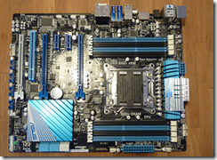
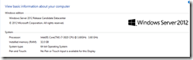
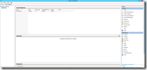
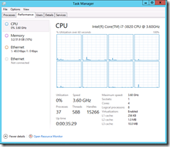
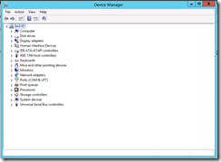
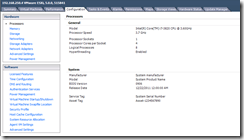
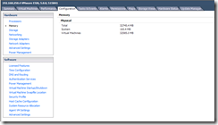
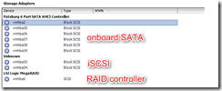
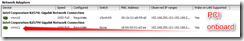
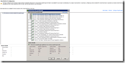

In an earlier blog post (found [here](https://www.ivobeerens.nl/2011/11/18/time-for-new-whitebox-for-your-VMware-vSphere-or-ms-hyper-v-home-lab-environment/)) I mentioned that it is time for a new homebrew whitebox based on the Intel X79 chipset. With the X79 chipset it is possible to install 64GB of memory (8 x 8 GB). Because the 8 GB DIMMs are expensive on the moment, I decided to use 8 x 4GB DIMMs (total 32GB).

I decided to create one physical host for testing VMware vSphere 5, vCloud Director, VMware SRM, VMware View 5 etc. The possibility to create a physical ESXi5 server, create virtual ESXi  hosts on it and start VM on the virtual hosts is great! This feature is called nesting. How to do this, can be found on William Lam blog found [here](http://www.virtuallyghetto.com/2011/07/how-to-enable-support-for-nested-64bit.html).

### Components used for the VMware ESXi 5 / Microsoft Windows Server 2012 whitebox:
- Intel i7-3820 CPU 3.60 GHz, 4 cores, with Hyper threading 8 cores
- Zalman CNPS10X performance cooler
- Asus P9X79 s2011 motherboard. Some specs:
    - Socket 2011
    - 8 DIMM slots, supports 64GB memory
    - Expansions slots: 2 x PCIe 3.0 (dual x16), 1 x PCI (x8 mode), 2 x PCIe 2.0 x1, 1 x PCI
    - 2 SATA 6 Gb/s port, 4 x SATA 3 Gb/s
    - LAN: Intel 82579V Gigabit LAN controller
- 2 x Corsair Vengeance DDR3- 1600 16GB (4 x 4) kit, total 32GB memory (max 64GB)

The case, power supply, graphical card, RAID controller and extra NIC(S) are reused. Here are some photos of the configuration:

<table border="0" cellspacing="0" cellpadding="2" width="400"><tbody><tr><td valign="top" width="200"><a href="images/image10.png"></a></td><td valign="top" width="200"><a href="images/image11.png"></a></td></tr><tr><td valign="top" width="200"><a href="images/image12.png"></a></td><td valign="top" width="200"><a href="images/image13.png"></a></td></tr><tr><td valign="top" width="200"><a href="images/image14.png"></a></td><td valign="top" width="200"></td></tr></tbody></table>

When the hardware  configuration was done and tried to power on the system, nothing happened (black screen). The appears that BIOS of the motherboard didn’t know the i7-3820 CPU yet. The cool thing is that the motherboard has a function called “USB BIOS Flashback”. It is possible to flash the BIOS without CPU or memory installed. Here are the steps:
- Download the latest BIOS from the Asus site;
- Extract the BIOS on a USB stick;
- Rename the BIOS file, example: rename “P9X79-ASUS-0906.ROM” in “P9X79.ROM” (**important**);
- Place the USB stick in the USB port with the WHITE interior on the back;
- Press the BIOS flashback button for 3 seconds and the light will begin to flash;
- Don’t turn of the computer during the BIOS flash;
- When the flashing light stop, the BIOS has been complete;

After the BIOS update was finished, the system boots and I was able to install VMware ESXi and Windows Server 2012 and enable the Hyper-V role.

### vSphere 5 / ESXi 5 screenshots:

<table border="0" cellspacing="0" cellpadding="2" width="400"><tbody><tr><td valign="top" width="200"><a href="images/image15.png"></a></td><td valign="top" width="200"><a href="images/image16.png"></a></td></tr><tr><td valign="top" width="200">Hyper threading enables 8 cores</td><td valign="top" width="200">32GB memory</td></tr><tr><td valign="top" width="200"><a href="images/image17.png"></a></td><td valign="top" width="200"><a href="images/image18.png"></a></td></tr><tr><td valign="top" width="200">The onboard SATA controller is listed as Patsburg 6 Port SATA AHCI controller.  Software-RAID does not work  The hardware RAID controller is added as extra PCI card</td><td valign="top" width="200">The onboard Intel 82579V NIC is not supported in ESXi5. Use the procedure found <a href="https://www.ivobeerens.nl/2011/12/13/VMware-esxi-5-whitebox-nic-support/" target="_blank">here</a> to add the NIC. Use at your own risk!  The Intel 82574L NIC is added as extra PCIe card.</td></tr><tr><td valign="top" width="200">  The latest firmware includes support for DirectPath I/O</td><td valign="top" width="200">&nbsp;</td></tr></tbody></table>

### Microsoft Windows Server 2012

It is possible to install Microsoft Windows 2012 and enable the Hyper-V role. Here are some screenshots:

<table border="0" cellspacing="0" cellpadding="2" width="400"><tbody><tr><td valign="top" width="200"></td><td valign="top" width="200"></td></tr><tr><td valign="top" width="200"></td><td valign="top" width="200"></td></tr></tbody></table>

The onboard Intel 82579V NIC is not recognized in Windows Server 2012 by default. How-to enable the Intel 82579V NIC is explained in this explained in this [blog](https://www.ivobeerens.nl/2012/08/08/enable-the-intel-82579v-nic-in-windows-server-2012/) post.

This whitebox is a great extension to my home lab!