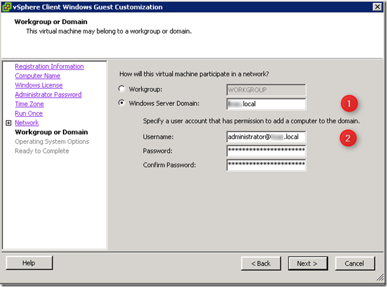

At a customer I was unable to join a domain when deploying a template from vCenter using a guest customization specification. This only happened with Windows 2008 R2 and Windows 7 templates.

To solve this problem, you need the do the following in the guest customization specification:
- Enter the FQDN name in Windows Server Domain field (1)
- Enter the [user@domain\_FQDN](mailto:user@domain_FQDN) in the username field (2)

[]

I used the NetBIOS domain name in the “Windows Server Domain” field and “domain\\username” in the username field what doesn’t work with Windows 2008 R2 and Windows 7 anymore.

More information can be found [**here**](https://kb.vmware.com/s/article/10123144) state that you need to fill in.