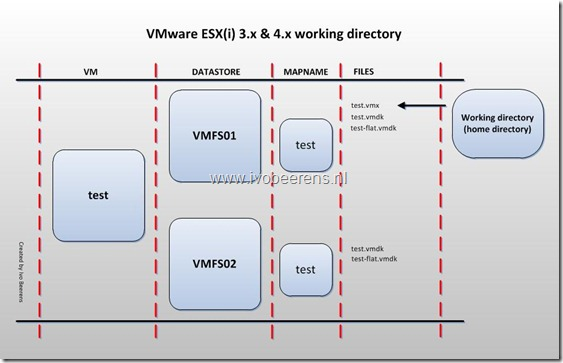
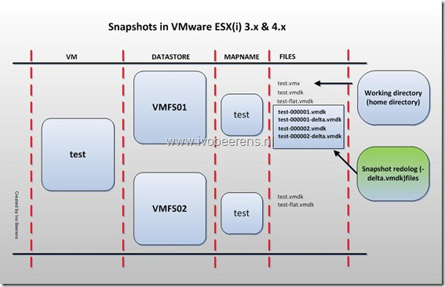
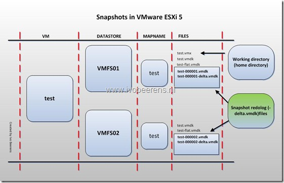

In ESX(i) 3.x and 4.x snapshots files are default created in the virtual machine’s working directory (home directory). The working directory is the same directory as the were the virtual machine configuration (\*.vmx) file is stored.

In this example a VM called “test” that has two disks (VMDK’s) placed on two datastores. The first disk is created on the VMFS01 datastore and the second disk is created on the VMFS02 datastore.  When a snapshot is created,  the VM “test”, the snapshot redolog (-delta.vmdk) files are place in the working directory (home directory). So the snapshots files are created on datastore VMFS01.

In ESXi 5 the snapshot delta disks are stored in the same home folder as the base disk. On every disk a snapshot file is created.

I have seen VMware ESX(i) 3.x and 4.x environments were only the working directory (home directory) **is sized** to store snapshot files . The other datastores didn’t have enough room for storing snapshot files.  So be sure before upgrading to vSphere 5 that all the datastores have enough free space to store snapshot files!

The snapshot location **can** changed in ESXi 5 but when performing a Storage vMotion, all the snapshot deltas will get migrated to the same folder as the VM's base disk on the destination. 

**Be sure to check this before upgrading to VMware vSphere 5!**