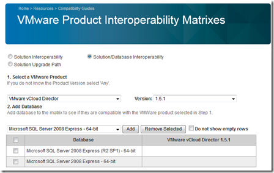
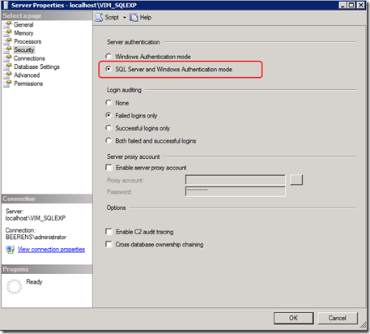
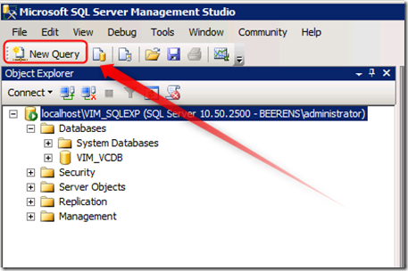
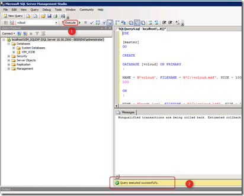
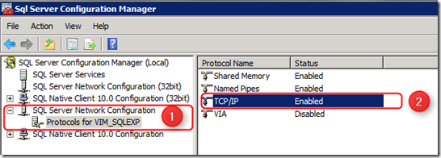
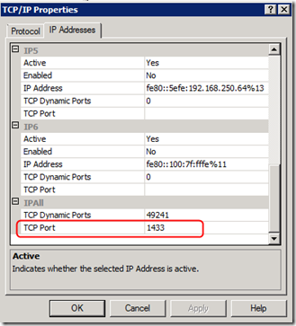
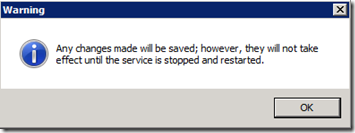
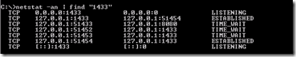
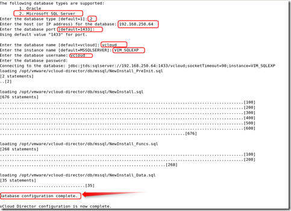

This blog will explain how to configure the vCenter Server SQL Express 2008 R2 instance to host the vCloud Director database. This can be handy when you have limited resources in your test environment. SQL Server Express 2008 R2 is not a supported database for vCloud Director. For production environments check always first the VMware interoperability Matrix to know what’s supported .

[](images/image.png)

#### Steps:

- Make sure SQL Server Management Studio is installed on the vCenter server.  See “[Add SQL Server Management Studio to Microsoft SQL Server Express 2008 R2](https://www.ivobeerens.nl/2011/12/08/add-sql-server-management-studio-to-microsoft-sql-server-express-2008-r2/)”
- Open SQL Server Management  Studio
- Change  Server Authentication to Mixed Authentication (SQL Server and Windows Authentication mode)

[](images/image1.png)

- Select “New Query”

[](images/image2.png)

- The following script (from [vCloud Director installation and configuration guide](http://www.VMware.com/pdf/vcd_15_install.pdf)) creates a database named “vcloud” on the c-drive  and a special SQL user "vcloud” . Customize this script for your environment.
- Paste this script in the “New Query” window”

```
USE \[master\]
GO
CREATE DATABASE \[vcloud\] ON PRIMARY
(NAME = N'vcloud', FILENAME = N'C:\\vcloud.mdf', SIZE = 100MB, FILEGROWTH = 10% )
    
LOG ON
    
(NAME = N'vcdb\_log', FILENAME = N'C:\\vcloud.ldf', SIZE = 1MB, FILEGROWTH = 10%)
COLLATE Latin1\_General\_CS\_AS
GO
    
USE \[vcloud\]
GO
ALTER DATABASE \[vcloud\] SET SINGLE\_USER WITH ROLLBACK IMMEDIATE;
ALTER DATABASE \[vcloud\] SET ALLOW\_SNAPSHOT\_ISOLATION ON;
ALTER DATABASE \[vcloud\] SET READ\_COMMITTED\_SNAPSHOT ON WITH NO\_WAIT;
ALTER DATABASE \[vcloud\] SET MULTI\_USER;
    
GO
    
USE \[vcloud\]
    
GO
    
CREATE LOGIN \[vcloud\] WITH PASSWORD = 'vcloudpass', DEFAULT\_DATABASE =\[vcloud\], DEFAULT\_LANGUAGE =\[us\_english\],CHECK\_POLICY=OFF
    
GO
    
CREATE USER \[vcloud\] for LOGIN \[vcloud\]
    
GO
    
USE \[vcloud\]
    
GO
    
sp\_addrolemember \[db\_owner\], \[vcloud\]
    
GO
```

- Execute the script (1)  and make sure it has executed successfully (2)
    
[](images/image3.png)

- Open Start – All Programs – Microsoft SQL Server 2008 R2 – Configuration Tools – SQL Server Configuration Manager
- Expand the “SQL Server Network Configuration” (1)
- Select TCP/IP (2) and open the properties
    
[](images/image4.png)
    
- In the IPALL section, select the TCP port and fill in “1433”
    
[](images/image5.png)
    
- Restart the SQL Server (VIM\_SQLEXP) service
    
[](images/image6.png)
    
- Open the command prompt on the SQL Server and check if port 1433 is listening by using this command:
```    
netstat -an | find "1433"
```    

[](images/image7.png)
    
- Configure vCloud Director and point to the SQL Express instance

[](images/image8.png)