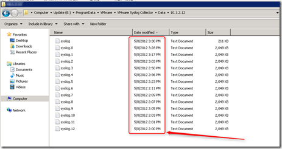
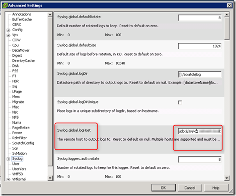
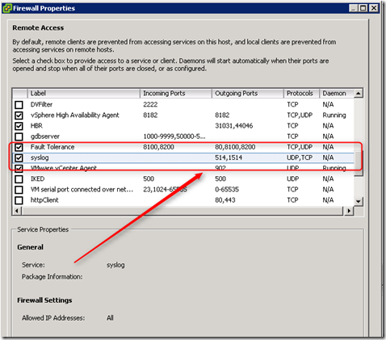
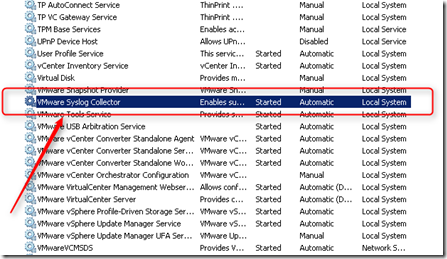

During a VMware health check, I noticed that the syslog files aren’t updated anymore in the repository from he vSphere Syslog Collector server.

[]

Here are some basic steps I used to troubleshoot this problem.

### **VMware ESXi hosts**

On the VMware ESXi hosts check the following settings:

- Syslog destination. Open the vSphere Client. On the ESXi server, open the **configuration** tab and select **advanced** Settings. Check the **Syslog.global.logHost** value. The format is: **protocol://FQDN:port** . For example **udp://syslog.beerens.local:514**

[]

- Is the ESXi firewall port open for syslog traffic. Open the vSphere Client, on the ESXi server, open the Configuration tab, select Security Profile, Firewall and select Properties. Check if the syslog service is enabled.

[]

### vSphere Syslog Collector

On the vSphere Syslog Collector server check the following settings:

- Is the syslog port 514 (default) listening:

[]

-  Reload and update the syslog configuration.  On the ESXi host use the following command:
```
esxcli system syslog reload
```

In PowerCLI, the following command can be used to reload the syslog settings:

```
$esxCli = Get-EsxCli
$esxCli.system.syslog.reload()
```

- Is the Syslog Collector service started. Restart the Syslog Collector service if needed

[]

After the reloading the syslog settings and restarting the **Syslog Collector service** the files begun to update again in the repository.