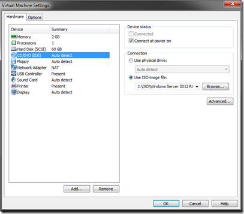
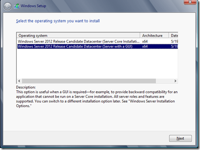
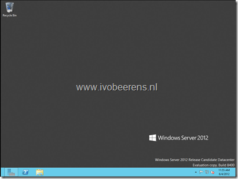

This procedure describes how to install Windows Server 2012 in VMware Workstation. The following versions are used:

- VMware Workstation Technology Preview 2012 e.x.p Build-646643
- Windows Server 2012 Release Candidate Datacenter Build 8400

In VMware Workstation Technology Preview 2012 create a new VM with the following settings:
- New Virtual Machine
- Custom (advanced)
- Workstation Tech Preview
- Select “I will install the operating system later”
- Select “Microsoft Windows” and select as version “Windows 8 x64”
- Set the Name and Location
- Minimal 1 processor, 1 core
- 2048 MB memory
- Select “Use network address translation (NAT)”
- Select “LSI Logic SAS”
- Create a new virtual disk
- SCSI
- 60 GB disk size
- Leave default disk file
- Finish
- After the VM is created, edit virtual Machine settings and browse for  the Windows Server 2012 ISO in the the CD/DVD option

[]

- Remove the VM from VMware Workstation by clicking on the X icon

[]

- Edit the VMX file (i use Notepad++)  and add the following line  to the end to of the VMX file:
```
vmGenCounter.enable = FALSE
```
- Add the VM back to VMware Workstation by clicking on the \*.VMX file

- During the installation choose the Windows Server 2012 Release Candidate (Server wit GUI)

[]

- When the installation is ready you have a working Windows Server 2012 server

[]

- Install VMware tools