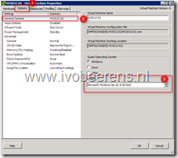
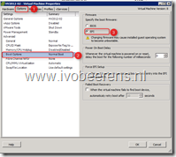
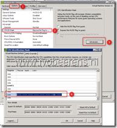
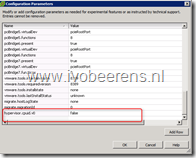
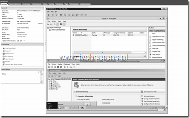

In this blog post I explain how you can install Windows 2012 Server Release Candidate (RC) in VMware ESXi and enable the Hyper-V role. It is possible to build a Hyper-V cluster LAB and live migrate VMs between the virtual Hyper-V nodes on one VMware ESXi 5 host.

Before you begin make sure:

- Windows 2012 Server RC ISO is place on a datastore
- VMware ESXi 5 Update 1 is installed with the latest updates
- To be able to boot 64bit guest OSes, make sure that on the VMware ESXi host the line below is added to the **/etc/VMware/config** file on your physical ESXi 5.x host:

`vhv.allow = TRUE`

Create a new VM with the following settings (adjust the settings for your own need):

- Configuration – **Custom**

- Name – **HV2012-02**

- Storage – Choose **VMFS**

- Virtual Machine Version - **Virtual Machine Version 8**

- Guest Operating System – **Microsoft Windows Server 2008 R2 (64-bit)**

- CPUs – **2 Sockets, 2 Cores**

- Memory – **4 GB**

- Network – **4 NICs VMXNET 3**

- SCSI Controller – **LSI logic SAS**

- Create a new virtual disk

- Disk Size – **40 GB**

- Virtual Device Node – **SCSI(0:0)**

- **Finish**

After the VM is created edit  the VM configuration and add or change the following settings:

- Hardware – CD/DVD drive 1 – Datastore ISO file – browse to the Windows Server 2012 ISO

- Options – General  Options – Guest Operating System – **Microsoft Windows Server 8 (64-bit**)

- Options – CPUID Mask – Advanced – Level 1 ecx (**add the mask below for Intel Hosts**)

---- ---- ---- ---- ---- ---- --H- ----

- Options – Boot Options – Specify the boot firmware - **EFI**

<table border="0" cellspacing="0" cellpadding="2" width="400"><tbody><tr><td valign="top" width="200"></td><td valign="top" width="200"></td></tr><tr><td valign="top" width="200"></td><td valign="top" width="200"></td></tr></tbody></table>

- Options – General – Configuration Parameters – Add Row – Add the line below (without =)

hypervisor.cpuid.v0 = FALSE 

- Start the VM and install Windows Server 2012 

- Install VMware tools

- Add the Hyper-V role

If you need to install more Windows Server 2012 Hyper-V VMs, create a template so that you only need to do the settings once.

