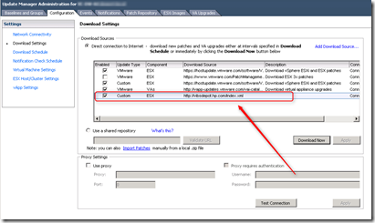
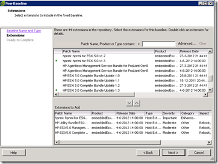
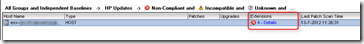
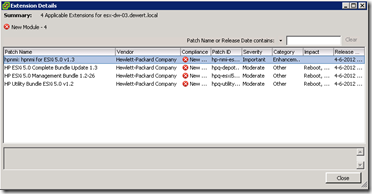
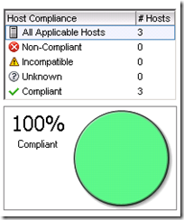

HP has created a vSphere Installation Bundle (VIB) depot for all sort of important HP driver bundles for VMware vSphere 5 and higher. The VIP depot contains:

- HP ESXi 5.0 Management Providers bundle - includes the latest HP Common Information Model (CIM) Providers, HP Integrated Lights-Out (iLO) driver, HP Compaq ROM Utility (CRU) driver, and the new HP Agentless Management Service (AMS).
- HP ESXi 5.0 Utilities bundle - ESXCLI utilities such as HPBOOTCFG (boot order configuration),HPONCFG (remote iLO configuration) and HPACUCLI (Smart Array reporting and configuration)
- HP ESXi 5.0 NMI bundle - Non Maskable Interrupt (NMI) driver used to write VMware® errors to the Insight Management Log (IML)
- HP Agentless Management Service Offline Bundle - a service that provides support for Agentless Management and Active Health. Agentless Management Service provides a wider range of server information (e.g. OS type and version, installed applications, IP addresses) allowing customers to complement hardware management with OS information and alerting. Agentless Management provides Integrated Lights Out (iLO) based robust management without the complexity of OS-based agents. Active Health provides 24x7 mission control for servers, delivering maximum uptime through automated monitoring, diagnostics and alerting.
- Device Drivers as used in the HP Customized VMware images
- Latest ProLiant Server and option firmware and driver version recipe

The VIB depot can be used by the following tools:

- VMware Update Manager (VUM)
- ESXCLI
- ImageBuilder

With the HP VIB depot integration for example in VUM there is no need to download and install the bundles manually. In this blog post I explain how to add the HP VIB depot to VMware Update Manager (VUM) by using the following steps:

#### Add the VIB Depot to VUM

- Open the vCenter Client
- Select under Solution and Application in the main screen of the vCenter client – Update Manager
- Select configuration
- In the Download sources select - Add Download Source
- In Source URL use:
    - For HP Updates: http://vibsdepot.hpe.com/index.xml
    - For Dell Updates: http://VMwaredepot.dell.com/index.xml
- Press OK
- Select – Download Now to update the baseline

#### Create a new Baseline

- Select the Baselines and Groups tab
- Create
- Baseline Name  – HP Updates
- Baseline Type – Host Extension
- Extensions to Add – Select the extensions you need. In this example I selected the following extensions:
    
    - hpnmi for ESXi 5.0 v1.3
    
    - HP ESXi 5.0 Complete Bundle Update 1.3
    
    - HP ESXi 5.0 Management Bundle 1.2-26
    
    - HP Utility Bundle ESXi 5.0 v 1.2

- Finish

#### Attach the baseline and remediate

- Attach the baseline to the cluster

- Select the baseline and scan for patches and extensions
- The HP bundles that are missing are listed

- Use Remediate to install the HP bundles

When the hosts are rebooted and the remediation is finished, the Host Compliance overview is 100%.

Using the  HP VIB depot is great way of keep your HP server up-to-date with the latest HP bundles.