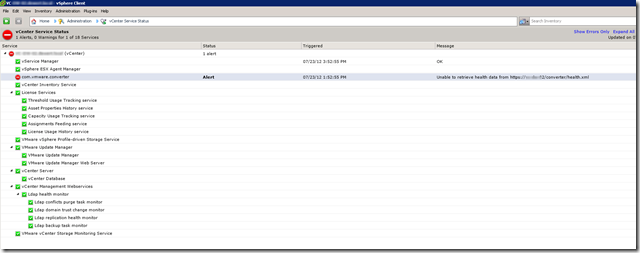
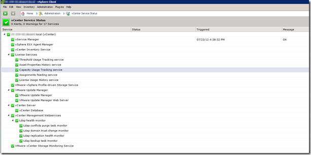

After upgrading to vCenter 5, the vCenter Service Status page displays the following error:

[]

com.VMware.converter alert unable to retrieve health data from https:///converter/health.xml

This error occurs because the integrated vCenter Converter plug-in is no longer available in vSphere 5!  To solve this error  following the VMware KB article listed below:

> **Error after upgrading to vCenter Server 5.0: com.VMware.converter alert unable to retrieve health data –** [**KB: 2006132**](http://kb.VMware.com/selfservice/microsites/search.do?language=en_US&cmd=displayKC&externalId=2006132)

After following the KB article, the  converter plug-in is removed from the vCenter Service Status page.

[]