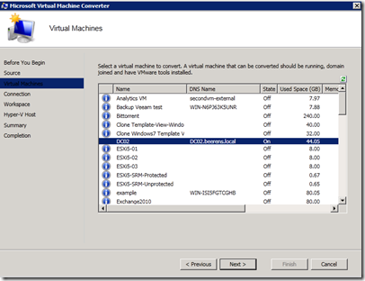
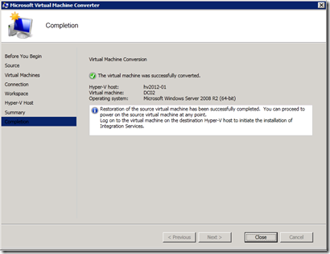

Last week Microsoft Virtual Machine Converter RC is released. Microsoft Virtual Machine Converter is a stand-alone tool that makes it possible to convert and deploys VMware based VMs to Hyper-V based VMs. It's coverts the VMware VM and virtual disks (VMDK) to Hyper-V VMs and Virtual Hard Disks (VHDs). As virtualization consultant I got "sometimes" involved in migrating VMware to Hyper-V VMs, so I tried Microsoft Virtual Machine Converter.

#### What's supported

Supported VMware platforms to convert from :

- vCenter Server 5.0
- vCenter Server 4.1
- VMware ESXi Server 5.0
- VMware ESXi/ESX Server 4.1

Supported Windows platforms to convert to:

- Windows Server® 2012 release candidate
- Microsoft Hyper-V Server 2012 release candidate
- Microsoft Hyper-V Server 2008 R2 SP1
- Windows Server 2008 R2 SP1

Guest operating Systems supported to convert:

- Windows Server 2003 SP2 x86 & x64
- Windows Server 2008 & 2008 R2 x86 & x64
- Windows Vista & 7 x86 & x64

MVMC will successfully perform virtual machine conversions when the following conditions are met:

- The virtual machine to be converted is in a running state
- The virtual machine has VMware tools installed (**make sure the VMware tools are up-to-date**!)
- The VMware VM is stopped during the VMDK copy process
- The virtual machine is joined to an Active Directory® domain.
- Remote access through Windows Management Instrumentation (WMI) is enabled on the VMware-based virtual machine to be converted and the destination Hyper-V host. See the "Troubleshooting" section in this guide for more details.
- The account used for connecting to the VMware-based virtual machine that needs to be converted is part of an Active Directory domain and also a local administrator on that machine.
- You have the correct credentials to connect to the required environments.
- The Windows user account that you are using has write access to the UNC path specified on the destination Hyper-V host for copying the virtual hard disks.
- The Hyper-V host has the required disk space available for the converted virtual hard disks.

#### How it works

Microsoft Virtual Machine Converter contains the following components:

- MVMC.exe, a command-line utility that converts VMware-based virtual machines to Hyper-V-based virtual machines
- MVMC.GUI.exe, a wizard-driven GUI that helps convert VMware-based virtual machines to Hyper-V-based virtual machines
- MVDC.exe, a command-line utility that converts VMware virtual disks (VMDK) to Hyper-V-based virtual hard disks (VHD)

The MVMC.GUI.exe provides a wizard-driven GUI. The conversion takes the following steps:

- Takes snapshot VMware VM
- Uninstall VMware tools
- Shutdown VM
- Copy the VMDKs to conversion machine
- Remove snapshot
- Depending on "final state" settings the VMware VM will be started or stopped
- Convert VMDKs to VHDs
- Import the VM in Hyper-V
- Installs integration services
- Depending on "final state" settings the Hyper-V VM will be started or stopped

I tested a conversion and deployment of a Windows 2008 R2 VM, hosted on a VMware vSphere 5 update 1 environment using the GUI. I executed the following steps:

- Install Microsoft Virtual Machine Converter. For best performance, it is recommended that you run the conversion on the destination host (Hyper-V host)
- Start MVMC.GUI.exe
- Enter the vCenter or ESXi information

- Select a **running** VM. Be aware that the VM will be stopped during the conversion!

- Specify account details en select the final state of the source and target

- Select the temporarily location to store the disks. Make sure it has enough free space (double size of the source VMDKs). It will store the VMDKs and convert the VMDKs to VHDs.

- Enter the Hyper-V server information and select the share to store the VHD. Make sure you have enough free space to store all the VHDs

- Some warnings will appear. Read them and click Finish

- The copy and conversion steps are executed

- The VM is converted successfully

- In Windows Server 2012 the VM can be started. It has the Integrated Components installed

#### Conclusion

Microsoft Virtual Machine Converter is a very basic VMware to Hyper-V conversion program. Here are some Pros and Cons:

**Pros**

- Support for Windows Server 2012
- Command line scripting possible

**Cons**

- It does not pre-check for example if there is sufficient disk space available. During the copy and conversion process you get a error when the disk is full. This cost a lot of extra time!
- The VMware tools must be up to date. With outdated VMware tools it is not possible to convert
- Hot cloning not possible. Downtime needed!
- No Linux support
- Pre-checks are not
- No disk alignment of Windows 2003

If you like it to do the other way, VMware has a tool called "[VMware vCenter Converter Standalone 5.0](https://my.VMware.com/web/VMware/details/converter5/dHclYnRqZEBiZEAldw==)" which convert Hyper-V based VMs to VMware vSphere VMs with more advanced functions to use such as hot cloning and disk aligning.